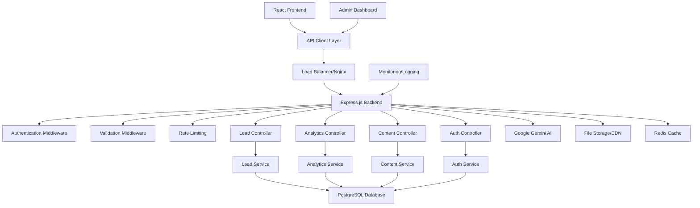

# Design Document

## Overview

The Backend API Migration transforms the portfolio from a client-side application with localStorage persistence to a full-stack application with a robust Node.js/Express backend and PostgreSQL database. The design emphasizes security, scalability, and maintainability while preserving the existing user experience and performance characteristics.

## Architecture

### High-Level System Architecture



### Data Flow Architecture

1. **Request Flow**: Frontend → API Client → Backend → Services → Database
2. **Authentication Flow**: Login → JWT Token → Protected Routes → Role Validation
3. **Data Migration Flow**: localStorage Export → Validation → Database Import → Verification
4. **Analytics Flow**: User Events → API → Analytics Service → Database → Dashboard

## Components and Interfaces

### Backend API Structure

#### Core Express Application
```typescript
interface BackendConfig {
  port: number;
  database: DatabaseConfig;
  jwt: JWTConfig;
  cors: CORSConfig;
  rateLimit: RateLimitConfig;
}

interface DatabaseConfig {
  host: string;
  port: number;
  database: string;
  username: string;
  password: string;
  ssl: boolean;
  pool: {
    min: number;
    max: number;
  };
}
```

#### API Controllers

##### Lead Controller
```typescript
interface LeadController {
  createLead(req: Request, res: Response): Promise<void>;
  getLeads(req: Request, res: Response): Promise<void>;
  getLeadById(req: Request, res: Response): Promise<void>;
  updateLead(req: Request, res: Response): Promise<void>;
  deleteLead(req: Request, res: Response): Promise<void>;
  analyzeLead(req: Request, res: Response): Promise<void>;
}

interface LeadFilters {
  status?: 'new' | 'contacted' | 'qualified' | 'converted';
  priority?: 'high' | 'medium' | 'low';
  dateFrom?: Date;
  dateTo?: Date;
  category?: string;
  page?: number;
  limit?: number;
}
```

##### Analytics Controller
```typescript
interface AnalyticsController {
  trackEvent(req: Request, res: Response): Promise<void>;
  getAnalytics(req: Request, res: Response): Promise<void>;
  getDashboardData(req: Request, res: Response): Promise<void>;
  getRealtimeStats(req: Request, res: Response): Promise<void>;
}

interface AnalyticsEvent {
  type: 'page_view' | 'interaction' | 'conversion' | 'error';
  page: string;
  userId?: string;
  sessionId: string;
  metadata: Record<string, any>;
  timestamp: Date;
}
```

##### Content Controller
```typescript
interface ContentController {
  createArticle(req: Request, res: Response): Promise<void>;
  getArticles(req: Request, res: Response): Promise<void>;
  getArticleBySlug(req: Request, res: Response): Promise<void>;
  updateArticle(req: Request, res: Response): Promise<void>;
  deleteArticle(req: Request, res: Response): Promise<void>;
  uploadImage(req: Request, res: Response): Promise<void>;
}

interface ArticleFilters {
  status?: 'draft' | 'published';
  category?: string;
  tags?: string[];
  search?: string;
  page?: number;
  limit?: number;
}
```

### Database Schema Design

#### Leads Table
```sql
CREATE TABLE leads (
  id UUID PRIMARY KEY DEFAULT gen_random_uuid(),
  name VARCHAR(255) NOT NULL,
  email VARCHAR(255) NOT NULL,
  message TEXT NOT NULL,
  type VARCHAR(50) NOT NULL CHECK (type IN ('contact', 'project')),
  project_type VARCHAR(100),
  budget VARCHAR(50),
  status VARCHAR(50) DEFAULT 'new' CHECK (status IN ('new', 'contacted', 'qualified', 'converted')),
  priority VARCHAR(20) DEFAULT 'medium' CHECK (priority IN ('high', 'medium', 'low')),
  ai_analysis JSONB,
  created_at TIMESTAMP WITH TIME ZONE DEFAULT NOW(),
  updated_at TIMESTAMP WITH TIME ZONE DEFAULT NOW()
);

CREATE INDEX idx_leads_status ON leads(status);
CREATE INDEX idx_leads_priority ON leads(priority);
CREATE INDEX idx_leads_created_at ON leads(created_at);
CREATE INDEX idx_leads_email ON leads(email);
```

#### Analytics Table
```sql
CREATE TABLE analytics_events (
  id UUID PRIMARY KEY DEFAULT gen_random_uuid(),
  event_type VARCHAR(50) NOT NULL,
  page VARCHAR(255) NOT NULL,
  user_id VARCHAR(255),
  session_id VARCHAR(255) NOT NULL,
  ip_address INET,
  user_agent TEXT,
  referrer VARCHAR(500),
  metadata JSONB,
  created_at TIMESTAMP WITH TIME ZONE DEFAULT NOW()
);

CREATE INDEX idx_analytics_type ON analytics_events(event_type);
CREATE INDEX idx_analytics_page ON analytics_events(page);
CREATE INDEX idx_analytics_session ON analytics_events(session_id);
CREATE INDEX idx_analytics_created_at ON analytics_events(created_at);
```

#### Blog Articles Table
```sql
CREATE TABLE blog_articles (
  id UUID PRIMARY KEY DEFAULT gen_random_uuid(),
  title VARCHAR(500) NOT NULL,
  slug VARCHAR(500) UNIQUE NOT NULL,
  content TEXT NOT NULL,
  excerpt TEXT,
  meta_description VARCHAR(500),
  featured_image VARCHAR(500),
  category VARCHAR(100) NOT NULL,
  tags TEXT[] DEFAULT '{}',
  status VARCHAR(20) DEFAULT 'draft' CHECK (status IN ('draft', 'published')),
  author VARCHAR(255) NOT NULL,
  reading_time INTEGER,
  view_count INTEGER DEFAULT 0,
  share_count INTEGER DEFAULT 0,
  seo_data JSONB,
  published_at TIMESTAMP WITH TIME ZONE,
  created_at TIMESTAMP WITH TIME ZONE DEFAULT NOW(),
  updated_at TIMESTAMP WITH TIME ZONE DEFAULT NOW()
);

CREATE INDEX idx_articles_status ON blog_articles(status);
CREATE INDEX idx_articles_category ON blog_articles(category);
CREATE INDEX idx_articles_published_at ON blog_articles(published_at);
CREATE INDEX idx_articles_slug ON blog_articles(slug);
CREATE INDEX idx_articles_tags ON blog_articles USING GIN(tags);
```

#### Users Table (Admin Authentication)
```sql
CREATE TABLE users (
  id UUID PRIMARY KEY DEFAULT gen_random_uuid(),
  username VARCHAR(100) UNIQUE NOT NULL,
  email VARCHAR(255) UNIQUE NOT NULL,
  password_hash VARCHAR(255) NOT NULL,
  role VARCHAR(50) DEFAULT 'admin' CHECK (role IN ('admin', 'editor')),
  is_active BOOLEAN DEFAULT true,
  last_login TIMESTAMP WITH TIME ZONE,
  created_at TIMESTAMP WITH TIME ZONE DEFAULT NOW(),
  updated_at TIMESTAMP WITH TIME ZONE DEFAULT NOW()
);

CREATE INDEX idx_users_username ON users(username);
CREATE INDEX idx_users_email ON users(email);
```

## API Endpoints Design

### Authentication Endpoints
```
POST   /api/auth/login          # Admin login
POST   /api/auth/refresh        # Token refresh
POST   /api/auth/logout         # Admin logout
GET    /api/auth/profile        # Get current user profile
```

### Lead Management Endpoints
```
POST   /api/leads               # Create new lead
GET    /api/leads               # Get leads with filtering/pagination
GET    /api/leads/:id           # Get specific lead
PUT    /api/leads/:id           # Update lead
DELETE /api/leads/:id           # Delete lead
POST   /api/leads/:id/analyze   # Re-analyze lead with AI
GET    /api/leads/stats         # Get lead statistics
```

### Analytics Endpoints
```
POST   /api/analytics/events    # Track analytics event
GET    /api/analytics/dashboard # Get dashboard analytics
GET    /api/analytics/realtime  # Get real-time statistics
GET    /api/analytics/reports   # Get detailed reports
```

### Content Management Endpoints
```
POST   /api/content/articles    # Create new article
GET    /api/content/articles    # Get articles with filtering
GET    /api/content/articles/:slug # Get article by slug
PUT    /api/content/articles/:id   # Update article
DELETE /api/content/articles/:id   # Delete article
POST   /api/content/images      # Upload images
GET    /api/content/sitemap     # Generate XML sitemap
```

### System Endpoints
```
GET    /api/health              # Health check
GET    /api/docs                # API documentation
GET    /api/version             # API version info
```

## Data Models

### Enhanced Lead Model
```typescript
interface Lead {
  id: string;
  name: string;
  email: string;
  message: string;
  type: 'contact' | 'project';
  projectType?: string;
  budget?: string;
  status: 'new' | 'contacted' | 'qualified' | 'converted';
  priority: 'high' | 'medium' | 'low';
  aiAnalysis?: {
    priority: string;
    summary: string;
    category: string;
    sentiment: 'positive' | 'neutral' | 'negative';
    keywords: string[];
  };
  createdAt: Date;
  updatedAt: Date;
}
```

### Analytics Event Model
```typescript
interface AnalyticsEvent {
  id: string;
  eventType: 'page_view' | 'interaction' | 'conversion' | 'error';
  page: string;
  userId?: string;
  sessionId: string;
  ipAddress?: string;
  userAgent?: string;
  referrer?: string;
  metadata: Record<string, any>;
  createdAt: Date;
}
```

### Blog Article Model
```typescript
interface BlogArticle {
  id: string;
  title: string;
  slug: string;
  content: string;
  excerpt?: string;
  metaDescription?: string;
  featuredImage?: string;
  category: string;
  tags: string[];
  status: 'draft' | 'published';
  author: string;
  readingTime?: number;
  viewCount: number;
  shareCount: number;
  seoData?: SEOMetadata;
  publishedAt?: Date;
  createdAt: Date;
  updatedAt: Date;
}
```

## Security Implementation

### Authentication Strategy
- **JWT Tokens**: Stateless authentication with access and refresh tokens
- **Token Expiry**: Short-lived access tokens (15 minutes) with longer refresh tokens (7 days)
- **Secure Storage**: HttpOnly cookies for refresh tokens, memory storage for access tokens
- **Role-Based Access**: Admin and editor roles with different permissions

### Input Validation and Sanitization
```typescript
interface ValidationRules {
  leads: {
    name: { required: true, maxLength: 255, sanitize: true };
    email: { required: true, format: 'email', maxLength: 255 };
    message: { required: true, maxLength: 5000, sanitize: true };
  };
  articles: {
    title: { required: true, maxLength: 500, sanitize: true };
    content: { required: true, sanitize: true };
    slug: { required: true, format: 'slug', unique: true };
  };
}
```

### Security Headers and CORS
```typescript
interface SecurityConfig {
  cors: {
    origin: string[];
    credentials: boolean;
    methods: ['GET', 'POST', 'PUT', 'DELETE'];
  };
  headers: {
    'X-Content-Type-Options': 'nosniff';
    'X-Frame-Options': 'DENY';
    'X-XSS-Protection': '1; mode=block';
    'Strict-Transport-Security': 'max-age=31536000';
  };
  rateLimit: {
    windowMs: 15 * 60 * 1000; // 15 minutes
    max: 100; // requests per window
  };
}
```

## Performance Optimization

### Database Optimization
- **Connection Pooling**: Efficient database connection management
- **Indexing Strategy**: Optimized indexes for common query patterns
- **Query Optimization**: Efficient queries with proper joins and filtering
- **Caching Layer**: Redis for frequently accessed data

### API Performance
```typescript
interface PerformanceConfig {
  caching: {
    articles: { ttl: 300 }; // 5 minutes
    analytics: { ttl: 60 }; // 1 minute
    leads: { ttl: 0 }; // No caching for sensitive data
  };
  compression: {
    enabled: true;
    threshold: 1024; // bytes
  };
  pagination: {
    defaultLimit: 20;
    maxLimit: 100;
  };
}
```

## Migration Strategy

### Data Migration Process
1. **Export Phase**: Extract all localStorage data to JSON files
2. **Validation Phase**: Validate data integrity and format
3. **Transform Phase**: Convert data to match new database schema
4. **Import Phase**: Insert data into PostgreSQL with conflict resolution
5. **Verification Phase**: Verify data accuracy and completeness

### Migration Service Implementation
```typescript
interface MigrationService {
  exportLocalStorageData(): Promise<MigrationData>;
  validateMigrationData(data: MigrationData): ValidationResult;
  transformData(data: MigrationData): TransformedData;
  importToDatabase(data: TransformedData): Promise<ImportResult>;
  verifyMigration(): Promise<VerificationResult>;
  rollback(): Promise<void>;
}

interface MigrationData {
  leads: any[];
  analytics: any[];
  articles: any[];
  metadata: {
    exportDate: Date;
    version: string;
    recordCounts: Record<string, number>;
  };
}
```

## Frontend Integration

### API Client Service
```typescript
interface APIClient {
  // Authentication
  login(credentials: LoginCredentials): Promise<AuthResponse>;
  refreshToken(): Promise<AuthResponse>;
  logout(): Promise<void>;
  
  // Leads
  createLead(lead: CreateLeadRequest): Promise<Lead>;
  getLeads(filters?: LeadFilters): Promise<PaginatedResponse<Lead>>;
  updateLead(id: string, updates: UpdateLeadRequest): Promise<Lead>;
  deleteLead(id: string): Promise<void>;
  
  // Analytics
  trackEvent(event: AnalyticsEvent): Promise<void>;
  getAnalytics(filters?: AnalyticsFilters): Promise<AnalyticsData>;
  
  // Content
  createArticle(article: CreateArticleRequest): Promise<BlogArticle>;
  getArticles(filters?: ArticleFilters): Promise<PaginatedResponse<BlogArticle>>;
  updateArticle(id: string, updates: UpdateArticleRequest): Promise<BlogArticle>;
}
```

### Error Handling Strategy
```typescript
interface APIError {
  code: string;
  message: string;
  details?: any;
  timestamp: Date;
}

interface ErrorHandling {
  network: {
    retry: { attempts: 3, delay: 1000 };
    timeout: 10000;
    fallback: 'cache' | 'offline' | 'error';
  };
  validation: {
    showFieldErrors: true;
    showSummary: true;
  };
  server: {
    show500: false;
    showGeneric: true;
    logErrors: true;
  };
}
```

## Monitoring and Logging

### Logging Strategy
```typescript
interface LoggingConfig {
  level: 'error' | 'warn' | 'info' | 'debug';
  format: 'json' | 'text';
  destinations: ('console' | 'file' | 'external')[];
  fields: {
    timestamp: boolean;
    level: boolean;
    message: boolean;
    requestId: boolean;
    userId?: boolean;
    ip?: boolean;
  };
}
```

### Health Monitoring
```typescript
interface HealthCheck {
  database: () => Promise<boolean>;
  redis: () => Promise<boolean>;
  externalAPIs: () => Promise<Record<string, boolean>>;
  diskSpace: () => Promise<boolean>;
  memory: () => Promise<boolean>;
}
```

## Correctness Properties

*A property is a characteristic or behavior that should hold true across all valid executions of a system-essentially, a formal statement about what the system should do. Properties serve as the bridge between human-readable specifications and machine-verifiable correctness guarantees.*

### Property-Based Testing Overview

Property-based testing (PBT) validates software correctness by testing universal properties across many generated inputs. Each property is a formal specification that should hold for all valid inputs.

### Core Properties

Property 1: CORS header consistency
*For any* cross-origin request to the API, appropriate CORS headers should be included in the response
**Validates: Requirements 1.5**

Property 2: Request logging completeness
*For any* API request, the request details should be logged with appropriate information and log level
**Validates: Requirements 1.6**

Property 3: Database relationship integrity
*For any* database operation involving foreign keys, referential integrity should be maintained
**Validates: Requirements 2.4**

Property 4: Timestamp field presence
*For any* database table, created_at and updated_at timestamp fields should be present and automatically populated
**Validates: Requirements 2.5**

Property 5: Database migration consistency
*For any* migration operation, the database schema should be updated consistently and version tracked
**Validates: Requirements 2.6**

Property 6: Lead creation persistence
*For any* valid lead submission, a corresponding database record should be created with all provided data
**Validates: Requirements 3.1**

Property 7: Lead CRUD operations
*For any* lead record, create, read, update, and delete operations should work correctly and maintain data integrity
**Validates: Requirements 3.2**

Property 8: Lead validation enforcement
*For any* lead creation attempt, all required fields should be validated and invalid data should be rejected
**Validates: Requirements 3.3**

Property 9: AI lead analysis integration
*For any* lead created, AI analysis should be performed and results stored with the lead record
**Validates: Requirements 3.4**

Property 10: Lead filtering accuracy
*For any* lead filter criteria (status, priority, date range), only matching leads should be returned
**Validates: Requirements 3.5**

Property 11: Lead pagination consistency
*For any* paginated lead request, the correct subset of results should be returned with accurate pagination metadata
**Validates: Requirements 3.6**

Property 12: JWT token generation and validation
*For any* valid authentication request, a secure JWT token should be generated and subsequently validate correctly
**Validates: Requirements 4.1**

Property 13: Credential validation
*For any* login attempt, valid credentials should return tokens and invalid credentials should be rejected
**Validates: Requirements 4.2**

Property 14: Token refresh functionality
*For any* valid refresh token, a new access token should be generated without requiring re-authentication
**Validates: Requirements 4.3**

Property 15: Endpoint authentication protection
*For any* protected endpoint, requests without valid authentication should be rejected with appropriate error codes
**Validates: Requirements 4.4**

Property 16: Role-based access control
*For any* user with a specific role, access should be granted only to endpoints appropriate for that role
**Validates: Requirements 4.5**

Property 17: Authentication event logging
*For any* authentication attempt (successful or failed), the event should be logged with appropriate details
**Validates: Requirements 4.6**

Property 18: Data export completeness
*For any* localStorage export operation, all existing data should be included in the exported JSON format
**Validates: Requirements 5.1**

Property 19: Data import accuracy
*For any* valid exported data, importing should recreate the same data structure in the database
**Validates: Requirements 5.2**

Property 20: Migration data integrity
*For any* data migration operation, data integrity should be maintained and conflicts handled appropriately
**Validates: Requirements 5.3**

Property 21: Migration rollback capability
*For any* failed migration, the rollback operation should restore the system to its previous state
**Validates: Requirements 5.4**

Property 22: Migration consistency
*For any* migration operation, data consistency should be maintained throughout the transition
**Validates: Requirements 5.5**

Property 23: Migration reporting accuracy
*For any* migration operation, the generated report should accurately reflect success and failure counts
**Validates: Requirements 5.6**

Property 24: API client retry logic
*For any* failed API request due to network issues, the client should automatically retry according to configured policy
**Validates: Requirements 6.2**

Property 25: API client error handling
*For any* network error, the API client should provide graceful fallback mechanisms and user-friendly error messages
**Validates: Requirements 6.3**

Property 26: API client caching behavior
*For any* cacheable request, subsequent identical requests should return cached results within the TTL period
**Validates: Requirements 6.4**

Property 27: Token management automation
*For any* API request requiring authentication, token management should be handled automatically by the client
**Validates: Requirements 6.5**

Property 28: Loading state management
*For any* API operation, appropriate loading states and error handling should be provided to the UI
**Validates: Requirements 6.6**

Property 29: Analytics event tracking
*For any* user interaction (page view, session, interaction), the corresponding analytics event should be tracked
**Validates: Requirements 7.1**

Property 30: Analytics data filtering
*For any* analytics query with date filters, only events within the specified date range should be returned
**Validates: Requirements 7.2**

Property 31: Analytics input validation
*For any* analytics event submission, invalid or malicious data should be rejected and valid data accepted
**Validates: Requirements 7.3**

Property 32: Real-time analytics updates
*For any* analytics event, real-time updates should be sent to connected clients via WebSocket
**Validates: Requirements 7.4**

Property 33: Analytics data aggregation
*For any* analytics dashboard request, data should be properly aggregated and formatted for display
**Validates: Requirements 7.5**

Property 34: Google Analytics integration
*For any* analytics event, data should be sent to both internal tracking and Google Analytics
**Validates: Requirements 7.6**

Property 35: Content CRUD operations
*For any* blog article, create, read, update, and delete operations should work correctly with proper validation
**Validates: Requirements 8.1**

Property 36: Content state management
*For any* blog article, draft and published states should be managed correctly and transitions validated
**Validates: Requirements 8.2**

Property 37: Content version history
*For any* content modification, version history should be maintained and previous versions recoverable
**Validates: Requirements 8.3**

Property 38: Content search functionality
*For any* content search query, relevant articles should be returned based on title and content matching
**Validates: Requirements 8.4**

Property 39: Image upload and optimization
*For any* image upload, the file should be validated, optimized, and stored with appropriate metadata
**Validates: Requirements 8.5**

Property 40: SEO metadata generation
*For any* published article, appropriate SEO metadata and sitemap entries should be automatically generated
**Validates: Requirements 8.6**

Property 41: API response caching
*For any* cacheable API endpoint, responses should be cached according to configured TTL and invalidation rules
**Validates: Requirements 9.4**

Property 42: Rate limiting enforcement
*For any* API endpoint with rate limiting, requests exceeding the limit should be rejected with appropriate error codes
**Validates: Requirements 9.6**

Property 43: Input validation universality
*For any* API endpoint, all input should be validated and sanitized before processing
**Validates: Requirements 10.1**

Property 44: SQL injection prevention
*For any* database query, parameterized queries should be used to prevent SQL injection attacks
**Validates: Requirements 10.2**

Property 45: Data encryption compliance
*For any* sensitive data, encryption should be applied both at rest and in transit
**Validates: Requirements 10.3**

Property 46: Security headers consistency
*For any* API response, appropriate security headers should be included (CORS, CSP, etc.)
**Validates: Requirements 10.4**

Property 47: Security event logging
*For any* security-related event (failed auth, suspicious activity), the event should be logged appropriately
**Validates: Requirements 10.5**

Property 48: Error response consistency
*For any* API error, the response should follow a consistent format across all endpoints
**Validates: Requirements 11.1**

Property 49: Structured logging compliance
*For any* log entry, it should follow the structured logging format with appropriate log levels
**Validates: Requirements 11.2**

Property 50: Error logging security
*For any* error that occurs, detailed information should be logged while protecting sensitive data from exposure
**Validates: Requirements 11.3**

Property 51: Health check functionality
*For any* health check request, the system should accurately report the status of all monitored components
**Validates: Requirements 11.4**

Property 52: User-friendly error messages
*For any* error response to clients, messages should be user-friendly without exposing system implementation details
**Validates: Requirements 11.5**

Property 53: Monitoring integration
*For any* critical system event, appropriate alerts should be sent to configured monitoring services
**Validates: Requirements 11.6**

## Error Handling

### Error Categories and Responses

#### Database Errors
- **Connection Failures**: Implement connection retry with exponential backoff
- **Query Errors**: Log detailed errors while returning generic messages to clients
- **Constraint Violations**: Provide specific validation error messages
- **Transaction Failures**: Implement proper rollback and recovery mechanisms

#### Authentication Errors
- **Invalid Credentials**: Return consistent error messages to prevent user enumeration
- **Token Expiry**: Implement automatic token refresh where possible
- **Authorization Failures**: Log security events and return appropriate HTTP status codes
- **Rate Limiting**: Implement progressive delays and clear error messages

#### Validation Errors
- **Input Validation**: Return field-specific error messages with validation rules
- **File Upload Errors**: Handle size limits, format restrictions, and security scanning
- **Data Format Errors**: Provide clear guidance on expected formats
- **Business Logic Violations**: Return contextual error messages

#### External Service Errors
- **AI Service Failures**: Implement graceful degradation for AI analysis features
- **Third-party API Errors**: Implement retry logic and fallback mechanisms
- **Network Timeouts**: Provide appropriate timeout handling and user feedback
- **Service Unavailable**: Implement circuit breaker patterns

## Testing Strategy

### Dual Testing Approach

The backend API will use comprehensive testing including unit, integration, and property-based testing:

#### Unit Tests
- **Controller Logic**: Test individual endpoint handlers and business logic
- **Service Layer**: Test business logic and data processing functions
- **Middleware**: Test authentication, validation, and error handling middleware
- **Utilities**: Test helper functions and data transformation utilities

#### Integration Tests
- **Database Operations**: Test complete CRUD workflows with real database
- **API Endpoints**: Test full request/response cycles including authentication
- **External Services**: Test integration with Google Gemini AI and other services
- **Migration Processes**: Test data migration and rollback procedures

#### Property-Based Tests
- **Universal Properties**: Test behaviors that should hold for all inputs
- **Security Properties**: Test that security measures work across all scenarios
- **Data Integrity**: Test that data consistency is maintained across operations
- **Performance Properties**: Test that performance requirements are met

### Property Test Configuration

Each property-based test will:
- **Run 100+ iterations** to ensure comprehensive coverage
- **Use realistic data generators** for leads, articles, and user inputs
- **Include edge case generation** for boundary conditions and security scenarios
- **Reference design properties** using the format: **Feature: backend-api-migration, Property N: [property description]**

### Testing Framework Integration

- **Unit Testing**: Jest for JavaScript/TypeScript unit testing
- **Integration Testing**: Supertest for API endpoint testing
- **Property Testing**: fast-check for property-based testing
- **Database Testing**: Test containers for isolated database testing
- **Load Testing**: Artillery or k6 for performance and load testing

### Test Organization

```
tests/
├── unit/
│   ├── controllers/
│   ├── services/
│   ├── middleware/
│   └── utils/
├── integration/
│   ├── api/
│   ├── database/
│   └── external-services/
├── properties/
│   ├── authentication.test.ts
│   ├── data-integrity.test.ts
│   ├── security.test.ts
│   └── performance.test.ts
├── load/
│   ├── api-load.test.js
│   └── database-load.test.js
└── fixtures/
    ├── leads.json
    ├── articles.json
    └── users.json
```

## Deployment and Infrastructure

### Containerization Strategy
```dockerfile
# Multi-stage Docker build for production optimization
FROM node:18-alpine AS builder
WORKDIR /app
COPY package*.json ./
RUN npm ci --only=production

FROM node:18-alpine AS runtime
WORKDIR /app
COPY --from=builder /app/node_modules ./node_modules
COPY . .
EXPOSE 3000
CMD ["npm", "start"]
```

### Environment Configuration
```typescript
interface EnvironmentConfig {
  development: {
    database: LocalPostgreSQL;
    logging: 'debug';
    cors: '*';
  };
  staging: {
    database: CloudPostgreSQL;
    logging: 'info';
    cors: StagingDomains;
  };
  production: {
    database: ProductionPostgreSQL;
    logging: 'warn';
    cors: ProductionDomains;
    ssl: true;
    monitoring: true;
  };
}
```

### CI/CD Pipeline
```yaml
# GitHub Actions workflow for automated testing and deployment
name: Backend API CI/CD
on: [push, pull_request]
jobs:
  test:
    runs-on: ubuntu-latest
    services:
      postgres:
        image: postgres:14
        env:
          POSTGRES_PASSWORD: test
    steps:
      - uses: actions/checkout@v3
      - uses: actions/setup-node@v3
      - run: npm ci
      - run: npm run test:unit
      - run: npm run test:integration
      - run: npm run test:properties
  
  deploy:
    needs: test
    runs-on: ubuntu-latest
    if: github.ref == 'refs/heads/main'
    steps:
      - run: docker build -t backend-api .
      - run: docker push ${{ secrets.REGISTRY }}/backend-api
```