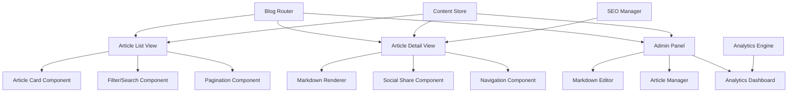

# Design Document

## Overview

The Blog System will be implemented as a client-side content management and rendering system integrated into the existing React/TypeScript portfolio. The design emphasizes performance, maintainability, and seamless integration with the current elite aesthetic while providing comprehensive blogging capabilities.

## Architecture

### High-Level Architecture



### Data Flow Architecture

The system follows a unidirectional data flow pattern:
1. **Content Creation**: Admin Panel → Content Store → Local Storage
2. **Content Display**: Local Storage → Content Store → React Components
3. **User Interaction**: User Actions → State Updates → Re-rendering
4. **Analytics**: User Events → Analytics Engine → Metrics Storage

## Components and Interfaces

### Core Components

#### BlogRouter Component
```typescript
interface BlogRouterProps {
  basePath: string;
}

interface BlogRoute {
  path: string;
  component: React.ComponentType;
  exact?: boolean;
}
```

Manages routing between blog list, article detail, and admin views. Integrates with existing portfolio navigation.

#### ArticleListView Component
```typescript
interface ArticleListViewProps {
  category?: string;
  tag?: string;
  searchQuery?: string;
  page?: number;
}

interface ArticlePreview {
  id: string;
  title: string;
  excerpt: string;
  publishedAt: Date;
  category: string;
  tags: string[];
  readingTime: number;
  slug: string;
}
```

Displays paginated list of articles with filtering and search capabilities.

#### ArticleDetailView Component
```typescript
interface ArticleDetailViewProps {
  slug: string;
}

interface Article extends ArticlePreview {
  content: string;
  metaDescription: string;
  featuredImage?: string;
  author: string;
  updatedAt: Date;
  viewCount: number;
}
```

Renders full article content with SEO optimization and social sharing.

#### MarkdownEditor Component
```typescript
interface MarkdownEditorProps {
  value: string;
  onChange: (value: string) => void;
  onSave: (article: Partial<Article>) => void;
  preview?: boolean;
}

interface EditorState {
  content: string;
  title: string;
  category: string;
  tags: string[];
  status: 'draft' | 'published';
  metaDescription: string;
}
```

Provides rich markdown editing experience with live preview and auto-save.

#### MarkdownRenderer Component
```typescript
interface MarkdownRendererProps {
  content: string;
  className?: string;
}

interface RenderOptions {
  syntaxHighlighting: boolean;
  customComponents: boolean;
  sanitization: boolean;
}
```

Converts markdown to HTML with syntax highlighting and custom components.

### Data Models

#### Article Data Model
```typescript
interface Article {
  id: string;
  title: string;
  slug: string;
  content: string;
  excerpt: string;
  metaDescription: string;
  featuredImage?: string;
  category: string;
  tags: string[];
  status: 'draft' | 'published';
  publishedAt: Date;
  updatedAt: Date;
  author: string;
  readingTime: number;
  viewCount: number;
  shareCount: number;
  seoData: SEOMetadata;
}
```

#### SEO Metadata Model
```typescript
interface SEOMetadata {
  title: string;
  description: string;
  keywords: string[];
  openGraph: {
    title: string;
    description: string;
    image: string;
    type: 'article';
  };
  structuredData: {
    '@type': 'BlogPosting';
    headline: string;
    author: string;
    datePublished: string;
    dateModified: string;
  };
}
```

#### Analytics Data Model
```typescript
interface ArticleAnalytics {
  articleId: string;
  views: number;
  averageReadingTime: number;
  scrollDepth: number;
  shareCount: number;
  referrers: string[];
  lastViewed: Date;
}
```

## Data Storage Strategy

### Local Storage Schema
```typescript
interface BlogStorage {
  articles: Record<string, Article>;
  categories: Category[];
  analytics: Record<string, ArticleAnalytics>;
  settings: BlogSettings;
  backups: ArticleBackup[];
}

interface Category {
  id: string;
  name: string;
  slug: string;
  description: string;
  articleCount: number;
}

interface BlogSettings {
  articlesPerPage: number;
  defaultCategory: string;
  enableAnalytics: boolean;
  autoSave: boolean;
}
```

### Content Management
- **Primary Storage**: Browser localStorage for persistence
- **Backup Strategy**: Automatic exports to downloadable JSON files
- **Version Control**: Maintain last 5 versions of each article
- **Import/Export**: Support for markdown file import and bulk export

## SEO and Performance Optimization

### SEO Implementation
- **Dynamic Meta Tags**: Generate title, description, and Open Graph data per article
- **Structured Data**: JSON-LD markup for BlogPosting schema
- **URL Structure**: Clean slugs (e.g., `/blog/laravel-performance-tips`)
- **XML Sitemap**: Auto-generated sitemap including all published articles
- **Internal Linking**: Automatic related article suggestions

### Performance Optimization
- **Code Splitting**: Lazy load blog components to reduce initial bundle size
- **Image Optimization**: Automatic compression and lazy loading for article images
- **Caching Strategy**: Implement service worker for offline article reading
- **Bundle Analysis**: Separate markdown processing to reduce main bundle
- **Virtual Scrolling**: For large article lists to maintain performance

## Integration with Existing Portfolio

### Design Consistency
- **Color Scheme**: Maintain existing accent-primary (#ff4d00) and space color palette
- **Typography**: Use existing Inter font family and sizing scale
- **Components**: Reuse existing AnimatedIcon, MagneticButton, and motion patterns
- **Layout**: Follow existing responsive grid system and spacing

### Navigation Integration
- **Main Navigation**: Add "Blog" link to existing navbar
- **Breadcrumbs**: Implement breadcrumb navigation for article hierarchy
- **Search Integration**: Extend existing search functionality to include articles
- **Footer Links**: Add blog categories to footer navigation

### State Management Integration
- **Existing Patterns**: Follow current useState and useEffect patterns
- **Context Integration**: Extend existing context if needed for blog state
- **Analytics Integration**: Merge with existing Google Analytics implementation
- **Performance Monitoring**: Integrate with existing performance tracking

## Correctness Properties

*A property is a characteristic or behavior that should hold true across all valid executions of a system-essentially, a formal statement about what the system should do. Properties serve as the bridge between human-readable specifications and machine-verifiable correctness guarantees.*

### Property-Based Testing Overview

Property-based testing (PBT) validates software correctness by testing universal properties across many generated inputs. Each property is a formal specification that should hold for all valid inputs.

### Core Properties

Property 1: Article creation validation
*For any* article creation attempt, all required fields (title, content, category, status) must be present for the article to be saved successfully
**Validates: Requirements 1.2**

Property 2: Article persistence round trip
*For any* valid article, saving then loading should produce an equivalent article with all metadata intact
**Validates: Requirements 1.3**

Property 3: Article state management
*For any* article, the draft/published state should be maintained consistently across all operations
**Validates: Requirements 1.5**

Property 4: Published article filtering
*For any* blog listing request, only articles with published status should be displayed to readers
**Validates: Requirements 2.1**

Property 5: Article preview completeness
*For any* published article, the preview display should contain title, excerpt, publication date, category, and reading time
**Validates: Requirements 2.2**

Property 6: Category filtering accuracy
*For any* category selection, the filtered results should contain only articles belonging to that specific category
**Validates: Requirements 3.2**

Property 7: Tag filtering accuracy
*For any* tag selection, the filtered results should contain only articles tagged with that specific tag
**Validates: Requirements 3.4**

Property 8: Search functionality completeness
*For any* search query, results should include all articles where the query matches either title or content
**Validates: Requirements 3.5**

Property 9: SEO metadata generation
*For any* published article, appropriate meta tags, Open Graph data, and structured data should be automatically generated
**Validates: Requirements 4.1**

Property 10: URL slug generation
*For any* article title, the generated slug should be SEO-friendly (lowercase, hyphenated, no special characters)
**Validates: Requirements 4.2**

Property 11: Markdown parsing round trip
*For any* valid markdown content, parsing to HTML then extracting text should preserve the essential content structure
**Validates: Requirements 5.1**

Property 12: Code syntax highlighting
*For any* code block with a specified language, syntax highlighting should be applied correctly
**Validates: Requirements 5.2**

Property 13: Markdown feature support
*For any* markdown content containing tables, lists, links, images, or blockquotes, all elements should be properly rendered
**Validates: Requirements 5.3**

Property 14: Content sanitization security
*For any* user input containing potentially malicious content, the sanitized output should be safe for HTML rendering
**Validates: Requirements 5.6, 8.4**

Property 15: Analytics tracking accuracy
*For any* article view, page views and reading time should be accurately tracked and stored
**Validates: Requirements 6.1**

Property 16: Reading time calculation
*For any* article content, the estimated reading time should be calculated based on standard reading speed (200-250 words per minute)
**Validates: Requirements 6.2**

Property 17: Social sharing metadata
*For any* article being shared, the generated sharing text and Open Graph metadata should be appropriate for the target platform
**Validates: Requirements 7.2, 7.3**

Property 18: Content backup consistency
*For any* article modification, the backup should contain the complete article data and be recoverable
**Validates: Requirements 8.1, 8.2**

Property 19: Export format integrity
*For any* article export operation, the exported markdown should be valid and importable
**Validates: Requirements 8.3**

Property 20: Import validation
*For any* content import attempt, only valid file formats and properly structured content should be accepted
**Validates: Requirements 8.5**

## Error Handling

### Error Categories and Responses

#### Content Management Errors
- **Invalid Article Data**: Display field-specific validation messages
- **Save Failures**: Implement auto-save recovery with user notification
- **Import Errors**: Provide detailed feedback on file format issues
- **Export Failures**: Graceful fallback with manual copy option

#### Rendering Errors
- **Markdown Parse Errors**: Display raw content with error indicator
- **Image Load Failures**: Show placeholder with retry option
- **Syntax Highlighting Errors**: Fall back to plain text display
- **Component Render Errors**: Use error boundaries with recovery options

#### Storage Errors
- **LocalStorage Full**: Implement cleanup and compression strategies
- **Data Corruption**: Maintain backup copies for recovery
- **Version Conflicts**: Provide merge conflict resolution interface
- **Backup Failures**: Multiple backup strategies (download, cloud sync)

#### Network and Performance Errors
- **Slow Loading**: Implement progressive loading with skeleton screens
- **Image Optimization Failures**: Graceful degradation to original images
- **Search Timeouts**: Provide partial results with retry option
- **Analytics Failures**: Silent failure with offline queuing

## Testing Strategy

### Dual Testing Approach

The blog system will use both unit testing and property-based testing for comprehensive coverage:

#### Unit Tests
- **Specific Examples**: Test concrete scenarios like creating a specific article
- **Edge Cases**: Empty content, maximum length titles, special characters
- **Integration Points**: Component interactions and state management
- **Error Conditions**: Invalid inputs, storage failures, network errors

#### Property-Based Tests
- **Universal Properties**: Test behaviors that should hold for all inputs
- **Comprehensive Coverage**: Generate thousands of test cases automatically
- **Regression Prevention**: Catch edge cases that manual tests might miss
- **Performance Validation**: Test with various content sizes and structures

### Property Test Configuration

Each property-based test will:
- **Run 100+ iterations** to ensure comprehensive coverage
- **Use realistic data generators** for articles, markdown content, and user inputs
- **Include edge case generation** for boundary conditions
- **Reference design properties** using the format: **Feature: blog-system, Property N: [property description]**

### Testing Framework Integration

- **Testing Library**: React Testing Library for component testing
- **Property Testing**: fast-check for property-based testing in TypeScript
- **Markdown Testing**: Dedicated tests for markdown parsing and rendering
- **Performance Testing**: Lighthouse CI for performance regression detection
- **Visual Testing**: Snapshot testing for UI consistency

### Test Organization

```
tests/
├── unit/
│   ├── components/
│   ├── services/
│   └── utils/
├── integration/
│   ├── workflows/
│   └── api/
├── properties/
│   ├── content-management.test.ts
│   ├── rendering.test.ts
│   └── analytics.test.ts
└── performance/
    ├── load-times.test.ts
    └── bundle-size.test.ts
```