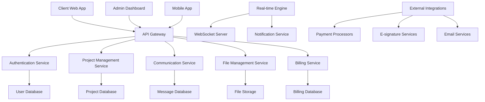

# Design Document

## Overview

The Client Portal System is a comprehensive web-based platform built with React/TypeScript frontend and Node.js/Express backend that provides project management, communication, and collaboration tools for clients. The design emphasizes security, user experience, and real-time collaboration while integrating with existing portfolio infrastructure.

## Architecture

### High-Level Architecture



### Service Architecture

The system follows a microservices architecture with the following core services:
1. **Authentication Service**: User management, SSO, and security
2. **Project Management Service**: Project lifecycle, milestones, and tracking
3. **Communication Service**: Messaging, notifications, and collaboration
4. **File Management Service**: Document storage, versioning, and sharing
5. **Billing Service**: Invoicing, payments, and financial tracking
6. **Notification Service**: Real-time updates and alerts
7. **Analytics Service**: Usage tracking and reporting

## Components and Interfaces

### Frontend Components

#### Client Dashboard Component
```typescript
interface ClientDashboard {
  // Project Overview
  projects: ProjectSummary[];
  recentActivity: Activity[];
  upcomingMilestones: Milestone[];
  
  // Quick Actions
  quickActions: QuickAction[];
  
  // Notifications
  notifications: Notification[];
  unreadCount: number;
  
  // Analytics
  projectMetrics: ProjectMetrics;
  timeMetrics: TimeMetrics;
}

interface ProjectSummary {
  id: string;
  name: string;
  status: ProjectStatus;
  progress: number;
  nextMilestone: Milestone;
  lastActivity: Date;
  teamMembers: TeamMember[];
  budgetUtilization: number;
}

type ProjectStatus = 'planning' | 'in_progress' | 'review' | 'completed' | 'on_hold';
```

#### Project Detail Component
```typescript
interface ProjectDetail {
  // Basic Information
  project: Project;
  timeline: ProjectTimeline;
  budget: ProjectBudget;
  
  // Progress Tracking
  milestones: Milestone[];
  deliverables: Deliverable[];
  tasks: Task[];
  
  // Communication
  discussions: Discussion[];
  announcements: Announcement[];
  
  // Files and Documents
  files: ProjectFile[];
  contracts: Contract[];
  
  // Team and Resources
  team: TeamMember[];
  resources: Resource[];
}

interface Project {
  id: string;
  name: string;
  description: string;
  status: ProjectStatus;
  startDate: Date;
  endDate: Date;
  estimatedHours: number;
  actualHours: number;
  budget: number;
  spent: number;
  client: Client;
  projectManager: TeamMember;
}
```

#### Communication Hub Component
```typescript
interface CommunicationHub {
  // Discussions
  discussions: Discussion[];
  activeDiscussion?: Discussion;
  
  // Real-time Chat
  chatMessages: ChatMessage[];
  onlineUsers: User[];
  
  // Announcements
  announcements: Announcement[];
  
  // File Sharing
  sharedFiles: SharedFile[];
}

interface Discussion {
  id: string;
  title: string;
  category: DiscussionCategory;
  priority: Priority;
  status: 'open' | 'resolved' | 'closed';
  messages: Message[];
  participants: User[];
  createdAt: Date;
  lastActivity: Date;
}

interface Message {
  id: string;
  content: string;
  author: User;
  timestamp: Date;
  attachments: Attachment[];
  reactions: Reaction[];
  isEdited: boolean;
  editedAt?: Date;
}
```

### Backend API Endpoints

#### Project Management API
```typescript
// Project Operations
GET    /api/v1/projects                    // List client projects
GET    /api/v1/projects/:id               // Get project details
PUT    /api/v1/projects/:id               // Update project (limited fields)
POST   /api/v1/projects/:id/feedback      // Submit project feedback

// Milestone and Timeline
GET    /api/v1/projects/:id/milestones    // Get project milestones
POST   /api/v1/projects/:id/milestones/:mid/approve  // Approve milestone
GET    /api/v1/projects/:id/timeline      // Get project timeline

// Deliverables
GET    /api/v1/projects/:id/deliverables  // List deliverables
GET    /api/v1/deliverables/:id           // Get deliverable details
POST   /api/v1/deliverables/:id/feedback  // Submit deliverable feedback
POST   /api/v1/deliverables/:id/approve   // Approve deliverable
```

#### Communication API
```typescript
// Discussions
GET    /api/v1/projects/:id/discussions   // List project discussions
POST   /api/v1/projects/:id/discussions   // Create new discussion
GET    /api/v1/discussions/:id            // Get discussion details
POST   /api/v1/discussions/:id/messages   // Post message to discussion

// Real-time Chat
GET    /api/v1/projects/:id/chat          // Get chat history
POST   /api/v1/projects/:id/chat          // Send chat message
GET    /api/v1/projects/:id/chat/online   // Get online users

// Notifications
GET    /api/v1/notifications              // Get user notifications
PUT    /api/v1/notifications/:id/read     // Mark notification as read
POST   /api/v1/notifications/preferences  // Update notification preferences
```

#### File Management API
```typescript
// File Operations
GET    /api/v1/projects/:id/files         // List project files
POST   /api/v1/projects/:id/files/upload  // Upload file
GET    /api/v1/files/:id                  // Download file
DELETE /api/v1/files/:id                  // Delete file (if permitted)

// Document Management
GET    /api/v1/projects/:id/documents     // List project documents
GET    /api/v1/documents/:id              // Get document details
POST   /api/v1/documents/:id/sign         // Request document signature
GET    /api/v1/documents/:id/versions     // Get document versions
```

#### Billing and Invoicing API
```typescript
// Time Tracking
GET    /api/v1/projects/:id/time          // Get time logs
GET    /api/v1/projects/:id/budget        // Get budget information
POST   /api/v1/projects/:id/time/approve  // Approve time entries

// Invoicing
GET    /api/v1/invoices                   // List client invoices
GET    /api/v1/invoices/:id               // Get invoice details
POST   /api/v1/invoices/:id/pay           // Process invoice payment
GET    /api/v1/invoices/:id/download      // Download invoice PDF

// Payment Management
GET    /api/v1/payments                   // List payment history
POST   /api/v1/payments/methods           // Add payment method
GET    /api/v1/payments/methods           // List payment methods
DELETE /api/v1/payments/methods/:id       // Remove payment method
```

### Data Models

#### Project Data Model
```typescript
interface Project {
  id: string;
  name: string;
  description: string;
  type: ProjectType;
  status: ProjectStatus;
  priority: Priority;
  
  // Timeline
  startDate: Date;
  endDate: Date;
  estimatedDuration: number;
  actualDuration?: number;
  
  // Budget and Resources
  budget: ProjectBudget;
  estimatedHours: number;
  actualHours: number;
  
  // Stakeholders
  clientId: string;
  projectManagerId: string;
  teamMembers: TeamMemberAssignment[];
  
  // Progress Tracking
  progress: number;
  milestones: Milestone[];
  deliverables: Deliverable[];
  
  // Communication
  discussions: Discussion[];
  announcements: Announcement[];
  
  // Files and Documents
  files: ProjectFile[];
  contracts: Contract[];
  
  // Metadata
  createdAt: Date;
  updatedAt: Date;
  createdBy: string;
  lastActivityAt: Date;
}

interface ProjectBudget {
  totalBudget: number;
  spentAmount: number;
  remainingBudget: number;
  budgetUtilization: number;
  
  // Budget Breakdown
  laborCost: number;
  materialCost: number;
  overheadCost: number;
  
  // Billing
  billingType: 'fixed' | 'hourly' | 'milestone';
  hourlyRate?: number;
  currency: string;
}
```

#### Milestone and Deliverable Models
```typescript
interface Milestone {
  id: string;
  projectId: string;
  name: string;
  description: string;
  
  // Timeline
  plannedDate: Date;
  actualDate?: Date;
  
  // Status and Progress
  status: MilestoneStatus;
  progress: number;
  
  // Dependencies
  dependencies: string[]; // Other milestone IDs
  blockers: Blocker[];
  
  // Deliverables
  deliverables: Deliverable[];
  
  // Approval
  requiresApproval: boolean;
  approvedBy?: string;
  approvedAt?: Date;
  
  // Metadata
  createdAt: Date;
  updatedAt: Date;
}

interface Deliverable {
  id: string;
  milestoneId: string;
  name: string;
  description: string;
  type: DeliverableType;
  
  // Status
  status: DeliverableStatus;
  
  // Files and Content
  files: DeliverableFile[];
  content?: string;
  
  // Review and Approval
  reviewStatus: ReviewStatus;
  feedback: Feedback[];
  approvals: Approval[];
  
  // Timeline
  dueDate: Date;
  submittedAt?: Date;
  approvedAt?: Date;
  
  // Metadata
  createdBy: string;
  assignedTo: string[];
  createdAt: Date;
  updatedAt: Date;
}

type MilestoneStatus = 'planned' | 'in_progress' | 'completed' | 'delayed' | 'cancelled';
type DeliverableStatus = 'pending' | 'in_progress' | 'submitted' | 'approved' | 'rejected';
type ReviewStatus = 'pending' | 'in_review' | 'approved' | 'needs_revision';
```

#### Communication Models
```typescript
interface Discussion {
  id: string;
  projectId: string;
  title: string;
  description?: string;
  category: DiscussionCategory;
  priority: Priority;
  
  // Status
  status: 'open' | 'resolved' | 'closed';
  
  // Participants
  participants: User[];
  watchers: User[];
  
  // Messages
  messages: Message[];
  messageCount: number;
  
  // Metadata
  createdBy: string;
  createdAt: Date;
  lastActivity: Date;
  lastMessage?: Message;
}

interface ChatMessage {
  id: string;
  projectId: string;
  content: string;
  type: 'text' | 'file' | 'system' | 'announcement';
  
  // Author
  authorId: string;
  author: User;
  
  // Content
  attachments: Attachment[];
  mentions: string[]; // User IDs
  
  // Reactions and Interactions
  reactions: Reaction[];
  replies: ChatMessage[];
  
  // Status
  isEdited: boolean;
  editedAt?: Date;
  isDeleted: boolean;
  deletedAt?: Date;
  
  // Metadata
  timestamp: Date;
  readBy: ReadReceipt[];
}

interface Notification {
  id: string;
  userId: string;
  type: NotificationType;
  title: string;
  message: string;
  
  // Context
  projectId?: string;
  entityId?: string;
  entityType?: string;
  
  // Status
  isRead: boolean;
  readAt?: Date;
  
  // Delivery
  channels: NotificationChannel[];
  deliveredAt?: Date;
  
  // Actions
  actions: NotificationAction[];
  
  // Metadata
  createdAt: Date;
  expiresAt?: Date;
}
```

### Real-time Communication

#### WebSocket Integration
```typescript
interface WebSocketManager {
  // Connection Management
  connect(userId: string, projectId: string): Promise<WebSocketConnection>;
  disconnect(connectionId: string): Promise<void>;
  
  // Message Broadcasting
  broadcastToProject(projectId: string, message: RealtimeMessage): Promise<void>;
  sendToUser(userId: string, message: RealtimeMessage): Promise<void>;
  
  // Presence Management
  updateUserPresence(userId: string, status: PresenceStatus): Promise<void>;
  getOnlineUsers(projectId: string): Promise<User[]>;
  
  // Event Handling
  onMessage(callback: (message: RealtimeMessage) => void): void;
  onUserJoin(callback: (user: User) => void): void;
  onUserLeave(callback: (user: User) => void): void;
}

interface RealtimeMessage {
  type: MessageType;
  payload: any;
  timestamp: Date;
  sender: User;
  projectId?: string;
}

type MessageType = 
  | 'chat_message'
  | 'project_update'
  | 'milestone_completed'
  | 'deliverable_submitted'
  | 'user_joined'
  | 'user_left'
  | 'typing_indicator'
  | 'notification';
```

## Security and Access Control

### Authentication and Authorization
```typescript
interface ClientAuthService {
  // Authentication
  authenticateClient(email: string, password: string): Promise<AuthResult>;
  enableMFA(userId: string, method: MFAMethod): Promise<MFASetup>;
  verifyMFA(userId: string, token: string): Promise<boolean>;
  
  // Session Management
  createClientSession(userId: string): Promise<ClientSession>;
  validateSession(sessionToken: string): Promise<SessionValidation>;
  
  // Access Control
  checkProjectAccess(userId: string, projectId: string): Promise<boolean>;
  getClientPermissions(userId: string, projectId: string): Promise<Permission[]>;
  
  // SSO Integration
  initiateSSOLogin(provider: SSOProvider): Promise<SSORedirect>;
  completeSSOLogin(code: string, state: string): Promise<AuthResult>;
}

interface ClientSession {
  id: string;
  userId: string;
  projectIds: string[];
  permissions: Permission[];
  expiresAt: Date;
  lastActivity: Date;
  ipAddress: string;
  userAgent: string;
}
```

### Data Privacy and Compliance
```typescript
interface PrivacyManager {
  // Data Access
  getClientData(userId: string): Promise<ClientDataExport>;
  deleteClientData(userId: string): Promise<DeletionResult>;
  
  // Consent Management
  recordConsent(userId: string, consentType: string): Promise<ConsentRecord>;
  withdrawConsent(userId: string, consentType: string): Promise<void>;
  
  // Audit and Compliance
  logDataAccess(userId: string, dataType: string, action: string): Promise<void>;
  generatePrivacyReport(timeRange: TimeRange): Promise<PrivacyReport>;
}
```

## Performance and Scalability

### Caching Strategy
- **Redis Cache**: Session data, frequently accessed project information
- **CDN Caching**: Static assets, file downloads, and media content
- **Application Cache**: User permissions, project metadata
- **Database Query Cache**: Optimized queries for dashboard and reporting

### Real-time Performance
- **WebSocket Optimization**: Connection pooling and message queuing
- **Event Streaming**: Efficient real-time updates using Server-Sent Events
- **Presence Management**: Optimized online user tracking
- **Message Throttling**: Rate limiting for chat and notifications

### Mobile Optimization
- **Progressive Web App**: Offline capabilities and native-like experience
- **Responsive Design**: Optimized layouts for mobile devices
- **Touch Interactions**: Mobile-friendly UI components and gestures
- **Performance**: Optimized loading and minimal data usage