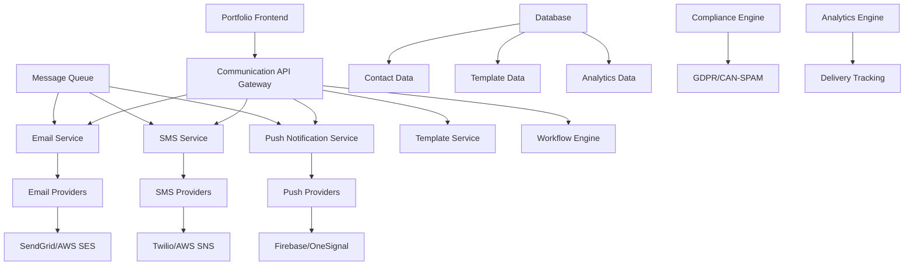

# Design Document

## Overview

The Communication Backend is a microservices-based system built with Node.js/TypeScript that provides comprehensive communication capabilities including email, SMS, WhatsApp, and push notifications. The design emphasizes reliability, scalability, and compliance while integrating seamlessly with the existing portfolio platform.

## Architecture

### High-Level Architecture



### Service Architecture

The system follows a microservices architecture with the following services:
1. **API Gateway**: Request routing, authentication, and rate limiting
2. **Email Service**: Transactional and marketing email management
3. **SMS Service**: SMS and WhatsApp messaging
4. **Push Notification Service**: Web and mobile push notifications
5. **Template Service**: Template management and rendering
6. **Workflow Engine**: Automated communication sequences
7. **Analytics Service**: Delivery tracking and performance metrics
8. **Compliance Service**: Privacy and regulatory compliance

## Components and Interfaces

### Core API Endpoints

#### Email Communication Endpoints
```typescript
// Email Operations
POST   /api/v1/email/send                 // Send single email
POST   /api/v1/email/send-bulk            // Send bulk emails
GET    /api/v1/email/status/:id           // Get delivery status
POST   /api/v1/email/templates            // Create email template
GET    /api/v1/email/templates            // List templates
PUT    /api/v1/email/templates/:id        // Update template

// Email Analytics
GET    /api/v1/email/analytics            // Email performance metrics
GET    /api/v1/email/deliverability       // Deliverability reports
POST   /api/v1/email/webhooks             // Handle provider webhooks
```

#### SMS and Messaging Endpoints
```typescript
// SMS Operations
POST   /api/v1/sms/send                   // Send SMS message
POST   /api/v1/whatsapp/send              // Send WhatsApp message
GET    /api/v1/sms/status/:id             // Get delivery status
POST   /api/v1/sms/templates              // Create SMS template

// Phone Number Management
POST   /api/v1/phone/validate             // Validate phone number
GET    /api/v1/phone/lookup/:number       // Phone number lookup
```

#### Push Notification Endpoints
```typescript
// Push Notification Operations
POST   /api/v1/push/send                  // Send push notification
POST   /api/v1/push/subscribe             // Subscribe to notifications
DELETE /api/v1/push/unsubscribe           // Unsubscribe from notifications
GET    /api/v1/push/subscriptions         // List subscriptions

// Notification Preferences
GET    /api/v1/push/preferences/:userId   // Get user preferences
PUT    /api/v1/push/preferences/:userId   // Update preferences
```

#### Workflow and Automation Endpoints
```typescript
// Workflow Management
POST   /api/v1/workflows                  // Create workflow
GET    /api/v1/workflows                  // List workflows
PUT    /api/v1/workflows/:id              // Update workflow
POST   /api/v1/workflows/:id/trigger      // Trigger workflow

// Workflow Analytics
GET    /api/v1/workflows/:id/analytics    // Workflow performance
GET    /api/v1/workflows/:id/executions   // Execution history
```

### Data Models

#### Email Message Model
```typescript
interface EmailMessage {
  id: string;
  templateId?: string;
  
  // Recipients
  to: EmailAddress[];
  cc?: EmailAddress[];
  bcc?: EmailAddress[];
  from: EmailAddress;
  replyTo?: EmailAddress;
  
  // Content
  subject: string;
  htmlContent?: string;
  textContent?: string;
  attachments?: Attachment[];
  
  // Personalization
  personalizations?: Record<string, any>;
  
  // Tracking
  trackOpens: boolean;
  trackClicks: boolean;
  
  // Scheduling
  sendAt?: Date;
  timezone?: string;
  
  // Metadata
  tags?: string[];
  customArgs?: Record<string, string>;
  
  // Status
  status: MessageStatus;
  deliveryAttempts: number;
  lastAttemptAt?: Date;
  deliveredAt?: Date;
  
  // Analytics
  opens: number;
  clicks: number;
  bounces: number;
  
  // Audit
  createdAt: Date;
  updatedAt: Date;
  createdBy: string;
}

interface EmailAddress {
  email: string;
  name?: string;
}

type MessageStatus = 'queued' | 'sending' | 'sent' | 'delivered' | 'bounced' | 'failed';
```

#### SMS Message Model
```typescript
interface SMSMessage {
  id: string;
  templateId?: string;
  
  // Recipients
  to: PhoneNumber;
  from: PhoneNumber;
  
  // Content
  content: string;
  mediaUrls?: string[];
  
  // Personalization
  personalizations?: Record<string, any>;
  
  // Scheduling
  sendAt?: Date;
  timezone?: string;
  
  // Provider Settings
  provider: 'twilio' | 'aws-sns' | 'messagebird';
  providerMessageId?: string;
  
  // Status
  status: MessageStatus;
  deliveryAttempts: number;
  lastAttemptAt?: Date;
  deliveredAt?: Date;
  
  // Cost Tracking
  cost?: number;
  currency?: string;
  
  // Audit
  createdAt: Date;
  updatedAt: Date;
  createdBy: string;
}

interface PhoneNumber {
  number: string;
  countryCode: string;
  formatted: string;
  validated: boolean;
}
```

#### Communication Template Model
```typescript
interface CommunicationTemplate {
  id: string;
  name: string;
  description?: string;
  
  // Template Type
  type: 'email' | 'sms' | 'whatsapp' | 'push';
  category: string;
  
  // Content
  subject?: string; // For email
  htmlContent?: string;
  textContent: string;
  
  // Variables and Personalization
  variables: TemplateVariable[];
  defaultValues?: Record<string, any>;
  
  // Conditional Logic
  conditions?: TemplateCondition[];
  
  // Versioning
  version: number;
  isActive: boolean;
  parentTemplateId?: string;
  
  // A/B Testing
  variants?: TemplateVariant[];
  
  // Analytics
  usageCount: number;
  performanceMetrics?: TemplateMetrics;
  
  // Audit
  createdAt: Date;
  updatedAt: Date;
  createdBy: string;
  lastUsedAt?: Date;
}

interface TemplateVariable {
  name: string;
  type: 'string' | 'number' | 'boolean' | 'date' | 'object';
  required: boolean;
  defaultValue?: any;
  description?: string;
}

interface TemplateCondition {
  variable: string;
  operator: 'equals' | 'not_equals' | 'contains' | 'greater_than' | 'less_than';
  value: any;
  action: 'show' | 'hide' | 'replace';
  content?: string;
}
```

#### Communication Workflow Model
```typescript
interface CommunicationWorkflow {
  id: string;
  name: string;
  description?: string;
  
  // Workflow Configuration
  trigger: WorkflowTrigger;
  steps: WorkflowStep[];
  
  // Status and Control
  isActive: boolean;
  status: 'draft' | 'active' | 'paused' | 'completed';
  
  // Execution Settings
  maxExecutions?: number;
  executionWindow?: TimeWindow;
  
  // Analytics
  totalExecutions: number;
  successfulExecutions: number;
  failedExecutions: number;
  
  // Performance Metrics
  averageCompletionTime: number;
  conversionRate: number;
  
  // Audit
  createdAt: Date;
  updatedAt: Date;
  createdBy: string;
  lastExecutedAt?: Date;
}

interface WorkflowTrigger {
  type: 'event' | 'schedule' | 'manual';
  eventType?: string; // 'contact_form_submitted', 'project_inquiry', etc.
  schedule?: CronExpression;
  conditions?: TriggerCondition[];
}

interface WorkflowStep {
  id: string;
  type: 'email' | 'sms' | 'push' | 'delay' | 'condition' | 'webhook';
  order: number;
  
  // Step Configuration
  templateId?: string;
  delay?: Duration;
  condition?: StepCondition;
  webhookUrl?: string;
  
  // Branching
  onSuccess?: string; // Next step ID
  onFailure?: string; // Next step ID
  
  // Analytics
  executionCount: number;
  successRate: number;
}
```

### Service Layer Architecture

#### Email Service
```typescript
class EmailService {
  async sendEmail(message: EmailMessage): Promise<EmailResult>;
  async sendBulkEmails(messages: EmailMessage[]): Promise<BulkEmailResult>;
  async getDeliveryStatus(messageId: string): Promise<DeliveryStatus>;
  async scheduleEmail(message: EmailMessage, sendAt: Date): Promise<ScheduleResult>;
  
  // Template Operations
  async renderTemplate(templateId: string, data: Record<string, any>): Promise<RenderedTemplate>;
  async validateTemplate(template: CommunicationTemplate): Promise<ValidationResult>;
  
  // Analytics
  async getEmailAnalytics(filters: AnalyticsFilters): Promise<EmailAnalytics>;
  async trackEmailEvent(messageId: string, event: EmailEvent): Promise<void>;
}
```

#### SMS Service
```typescript
class SMSService {
  async sendSMS(message: SMSMessage): Promise<SMSResult>;
  async sendWhatsApp(message: WhatsAppMessage): Promise<WhatsAppResult>;
  async validatePhoneNumber(phoneNumber: string): Promise<PhoneValidation>;
  async getDeliveryStatus(messageId: string): Promise<DeliveryStatus>;
  
  // Provider Management
  async selectOptimalProvider(phoneNumber: string): Promise<SMSProvider>;
  async handleProviderFailover(message: SMSMessage): Promise<SMSResult>;
  
  // Cost Management
  async estimateCost(message: SMSMessage): Promise<CostEstimate>;
  async trackCosts(timeRange: TimeRange): Promise<CostAnalytics>;
}
```

#### Push Notification Service
```typescript
class PushNotificationService {
  async sendPushNotification(notification: PushNotification): Promise<PushResult>;
  async subscribeUser(subscription: PushSubscription): Promise<SubscriptionResult>;
  async unsubscribeUser(subscriptionId: string): Promise<void>;
  async updatePreferences(userId: string, preferences: NotificationPreferences): Promise<void>;
  
  // Targeting and Segmentation
  async sendToSegment(notification: PushNotification, segment: UserSegment): Promise<PushResult>;
  async scheduleNotification(notification: PushNotification, sendAt: Date): Promise<ScheduleResult>;
  
  // Analytics
  async getNotificationAnalytics(filters: AnalyticsFilters): Promise<PushAnalytics>;
  async trackNotificationEvent(notificationId: string, event: NotificationEvent): Promise<void>;
}
```

#### Workflow Engine
```typescript
class WorkflowEngine {
  async createWorkflow(workflow: CommunicationWorkflow): Promise<Workflow>;
  async triggerWorkflow(workflowId: string, context: WorkflowContext): Promise<WorkflowExecution>;
  async pauseWorkflow(workflowId: string): Promise<void>;
  async resumeWorkflow(workflowId: string): Promise<void>;
  
  // Execution Management
  async executeStep(execution: WorkflowExecution, step: WorkflowStep): Promise<StepResult>;
  async handleStepFailure(execution: WorkflowExecution, step: WorkflowStep, error: Error): Promise<void>;
  
  // Analytics and Monitoring
  async getWorkflowAnalytics(workflowId: string): Promise<WorkflowAnalytics>;
  async getExecutionHistory(workflowId: string): Promise<WorkflowExecution[]>;
}
```

## Integration Architecture

### Provider Integration Strategy
```typescript
interface CommunicationProvider {
  name: string;
  type: 'email' | 'sms' | 'push';
  priority: number;
  isActive: boolean;
  
  // Configuration
  config: ProviderConfig;
  credentials: ProviderCredentials;
  
  // Capabilities
  supportsBulk: boolean;
  supportsScheduling: boolean;
  supportsTracking: boolean;
  
  // Limits and Quotas
  dailyLimit?: number;
  rateLimit?: RateLimit;
  
  // Health Monitoring
  healthStatus: 'healthy' | 'degraded' | 'unhealthy';
  lastHealthCheck: Date;
  
  // Performance Metrics
  averageDeliveryTime: number;
  deliveryRate: number;
  errorRate: number;
}

class ProviderManager {
  async selectProvider(type: string, criteria: SelectionCriteria): Promise<CommunicationProvider>;
  async handleFailover(originalProvider: CommunicationProvider, message: any): Promise<CommunicationProvider>;
  async monitorProviderHealth(): Promise<void>;
  async updateProviderMetrics(provider: CommunicationProvider, metrics: ProviderMetrics): Promise<void>;
}
```

### Queue Management System
```typescript
interface MessageQueue {
  name: string;
  type: 'email' | 'sms' | 'push' | 'workflow';
  priority: 'low' | 'normal' | 'high' | 'urgent';
  
  // Queue Configuration
  maxRetries: number;
  retryDelay: Duration;
  deadLetterQueue?: string;
  
  // Processing Settings
  batchSize: number;
  concurrency: number;
  processingTimeout: Duration;
  
  // Monitoring
  queueSize: number;
  processingRate: number;
  errorRate: number;
}

class QueueManager {
  async enqueueMessage(queue: string, message: any, priority?: string): Promise<void>;
  async processQueue(queueName: string): Promise<void>;
  async retryFailedMessages(queueName: string): Promise<void>;
  async getQueueMetrics(queueName: string): Promise<QueueMetrics>;
}
```

## Security and Compliance

### Data Protection and Privacy
```typescript
interface ComplianceSettings {
  gdprEnabled: boolean;
  canSpamCompliant: boolean;
  tcpaCompliant: boolean;
  
  // Data Retention
  dataRetentionPeriod: Duration;
  automaticCleanup: boolean;
  
  // Consent Management
  requireDoubleOptIn: boolean;
  consentRecordRetention: Duration;
  
  // Unsubscribe Handling
  oneClickUnsubscribe: boolean;
  unsubscribeProcessingTime: Duration;
}

class ComplianceManager {
  async recordConsent(contactId: string, consentType: string, source: string): Promise<ConsentRecord>;
  async processUnsubscribe(contactId: string, reason?: string): Promise<void>;
  async handleDataDeletion(contactId: string): Promise<DeletionResult>;
  async generateComplianceReport(timeRange: TimeRange): Promise<ComplianceReport>;
  
  // Audit and Logging
  async logComplianceEvent(event: ComplianceEvent): Promise<void>;
  async getAuditTrail(contactId: string): Promise<AuditTrail>;
}
```

## Performance and Monitoring

### Performance Optimization
- **Message Queuing**: Redis-based queue system for reliable message processing
- **Connection Pooling**: Efficient provider connection management
- **Caching Strategy**: Template and configuration caching
- **Batch Processing**: Bulk operations for high-volume messaging
- **Load Balancing**: Distribute load across multiple provider instances

### Monitoring and Alerting
```typescript
interface MonitoringMetrics {
  // Delivery Metrics
  deliveryRate: number;
  bounceRate: number;
  openRate: number;
  clickRate: number;
  
  // Performance Metrics
  averageDeliveryTime: number;
  queueProcessingTime: number;
  apiResponseTime: number;
  
  // Error Metrics
  errorRate: number;
  failureReasons: Record<string, number>;
  
  // Volume Metrics
  messagesPerHour: number;
  peakVolumeTime: Date;
  
  // Cost Metrics
  costPerMessage: number;
  totalCost: number;
}

class MonitoringService {
  async collectMetrics(): Promise<MonitoringMetrics>;
  async generateAlerts(thresholds: AlertThresholds): Promise<Alert[]>;
  async createDashboard(metrics: MonitoringMetrics): Promise<Dashboard>;
  async exportMetrics(format: 'json' | 'csv' | 'prometheus'): Promise<string>;
}
```