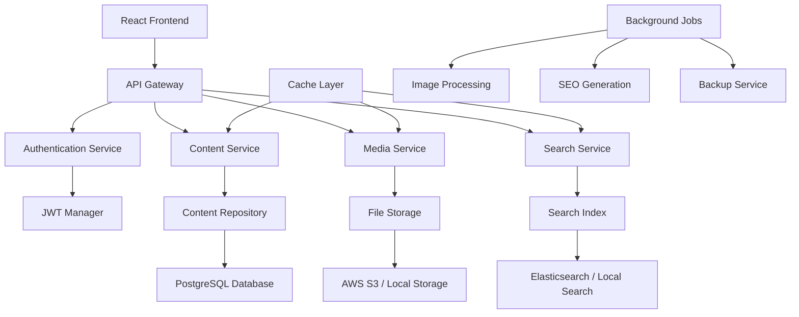

# Design Document

## Overview

The Content Management API is a Node.js/Express-based RESTful service that provides comprehensive content management capabilities for the portfolio platform. The design emphasizes scalability, security, and performance while integrating seamlessly with the existing React frontend and supporting future content needs.

## Architecture

### High-Level Architecture



### Service Architecture

The system follows a microservices-inspired modular architecture:
1. **API Gateway**: Request routing, rate limiting, and middleware
2. **Authentication Service**: JWT-based authentication and authorization
3. **Content Service**: Core content CRUD operations and workflow
4. **Media Service**: File upload, processing, and delivery
5. **Search Service**: Full-text search and content discovery
6. **Cache Layer**: Redis-based caching for performance optimization

## Components and Interfaces

### Core API Endpoints

#### Content Management Endpoints
```typescript
// Content CRUD Operations
GET    /api/v1/content                    // List content with pagination
GET    /api/v1/content/:id               // Get specific content
POST   /api/v1/content                   // Create new content
PUT    /api/v1/content/:id               // Update content
DELETE /api/v1/content/:id               // Soft delete content

// Content Publishing
POST   /api/v1/content/:id/publish       // Publish content
POST   /api/v1/content/:id/unpublish     // Unpublish content
POST   /api/v1/content/:id/schedule      // Schedule publishing

// Content Versioning
GET    /api/v1/content/:id/versions      // Get version history
GET    /api/v1/content/:id/versions/:vid // Get specific version
POST   /api/v1/content/:id/restore/:vid  // Restore version
```

#### Media Management Endpoints
```typescript
// Media Operations
POST   /api/v1/media/upload              // Upload media files
GET    /api/v1/media                     // List media with pagination
GET    /api/v1/media/:id                 // Get media metadata
DELETE /api/v1/media/:id                 // Delete media file
POST   /api/v1/media/:id/optimize        // Trigger optimization

// Media Processing
GET    /api/v1/media/:id/variants        // Get image variants
POST   /api/v1/media/batch-process       // Batch processing
```

#### Search and Discovery Endpoints
```typescript
// Search Operations
GET    /api/v1/search                    // Full-text search
GET    /api/v1/search/suggest            // Search suggestions
POST   /api/v1/search/reindex            // Rebuild search index

// Content Discovery
GET    /api/v1/categories                // List categories
GET    /api/v1/tags                      // List tags
GET    /api/v1/content/related/:id       // Related content
```

### Data Models

#### Content Model
```typescript
interface Content {
  id: string;
  title: string;
  slug: string;
  content: string;
  excerpt: string;
  status: 'draft' | 'review' | 'published' | 'archived';
  publishedAt?: Date;
  scheduledAt?: Date;
  expiresAt?: Date;
  
  // Metadata
  metaTitle?: string;
  metaDescription?: string;
  keywords: string[];
  
  // Organization
  categoryId?: string;
  tags: string[];
  
  // Media
  featuredImageId?: string;
  mediaIds: string[];
  
  // SEO
  seoScore?: number;
  openGraph: OpenGraphData;
  structuredData: StructuredData;
  
  // Versioning
  version: number;
  parentVersionId?: string;
  
  // Audit
  createdAt: Date;
  updatedAt: Date;
  createdBy: string;
  updatedBy: string;
}
```

#### Media Model
```typescript
interface Media {
  id: string;
  filename: string;
  originalName: string;
  mimeType: string;
  size: number;
  
  // File Storage
  storageProvider: 'local' | 's3' | 'cloudinary';
  storagePath: string;
  publicUrl: string;
  
  // Image Specific
  width?: number;
  height?: number;
  variants?: MediaVariant[];
  
  // Metadata
  altText?: string;
  caption?: string;
  description?: string;
  
  // Processing
  processed: boolean;
  processingStatus: 'pending' | 'processing' | 'completed' | 'failed';
  
  // Audit
  uploadedAt: Date;
  uploadedBy: string;
}

interface MediaVariant {
  size: 'thumbnail' | 'small' | 'medium' | 'large' | 'original';
  width: number;
  height: number;
  url: string;
  fileSize: number;
}
```

#### Category and Tag Models
```typescript
interface Category {
  id: string;
  name: string;
  slug: string;
  description?: string;
  parentId?: string;
  children?: Category[];
  contentCount: number;
  
  // SEO
  metaTitle?: string;
  metaDescription?: string;
  
  // Audit
  createdAt: Date;
  updatedAt: Date;
}

interface Tag {
  id: string;
  name: string;
  slug: string;
  description?: string;
  color?: string;
  contentCount: number;
  
  // Audit
  createdAt: Date;
  updatedAt: Date;
}
```

### Service Layer Architecture

#### Content Service
```typescript
class ContentService {
  async createContent(data: CreateContentDto): Promise<Content>;
  async updateContent(id: string, data: UpdateContentDto): Promise<Content>;
  async deleteContent(id: string): Promise<void>;
  async getContent(id: string, includeUnpublished?: boolean): Promise<Content>;
  async listContent(filters: ContentFilters): Promise<PaginatedResult<Content>>;
  
  // Publishing
  async publishContent(id: string): Promise<Content>;
  async scheduleContent(id: string, publishAt: Date): Promise<Content>;
  
  // Versioning
  async createVersion(id: string): Promise<ContentVersion>;
  async restoreVersion(id: string, versionId: string): Promise<Content>;
  async getVersionHistory(id: string): Promise<ContentVersion[]>;
}
```

#### Media Service
```typescript
class MediaService {
  async uploadMedia(file: Express.Multer.File, metadata: MediaMetadata): Promise<Media>;
  async processMedia(id: string): Promise<Media>;
  async generateVariants(id: string): Promise<MediaVariant[]>;
  async deleteMedia(id: string): Promise<void>;
  async getMedia(id: string): Promise<Media>;
  async listMedia(filters: MediaFilters): Promise<PaginatedResult<Media>>;
  
  // Optimization
  async optimizeImage(id: string): Promise<Media>;
  async generateWebP(id: string): Promise<MediaVariant>;
}
```

#### Search Service
```typescript
class SearchService {
  async indexContent(content: Content): Promise<void>;
  async removeFromIndex(contentId: string): Promise<void>;
  async search(query: SearchQuery): Promise<SearchResult>;
  async suggest(partial: string): Promise<string[]>;
  async reindexAll(): Promise<void>;
  
  // Analytics
  async trackSearch(query: string, results: number): Promise<void>;
  async getPopularSearches(): Promise<SearchAnalytics>;
}
```

## Data Storage Strategy

### Database Schema (PostgreSQL)
```sql
-- Content Tables
CREATE TABLE contents (
  id UUID PRIMARY KEY DEFAULT gen_random_uuid(),
  title VARCHAR(255) NOT NULL,
  slug VARCHAR(255) UNIQUE NOT NULL,
  content TEXT,
  excerpt TEXT,
  status content_status DEFAULT 'draft',
  published_at TIMESTAMP,
  scheduled_at TIMESTAMP,
  expires_at TIMESTAMP,
  
  -- Metadata
  meta_title VARCHAR(255),
  meta_description TEXT,
  keywords TEXT[],
  
  -- Organization
  category_id UUID REFERENCES categories(id),
  tags TEXT[],
  
  -- Media
  featured_image_id UUID REFERENCES media(id),
  media_ids UUID[],
  
  -- SEO
  seo_score INTEGER,
  open_graph JSONB,
  structured_data JSONB,
  
  -- Versioning
  version INTEGER DEFAULT 1,
  parent_version_id UUID REFERENCES content_versions(id),
  
  -- Audit
  created_at TIMESTAMP DEFAULT NOW(),
  updated_at TIMESTAMP DEFAULT NOW(),
  created_by UUID NOT NULL,
  updated_by UUID NOT NULL
);

-- Media Tables
CREATE TABLE media (
  id UUID PRIMARY KEY DEFAULT gen_random_uuid(),
  filename VARCHAR(255) NOT NULL,
  original_name VARCHAR(255) NOT NULL,
  mime_type VARCHAR(100) NOT NULL,
  size BIGINT NOT NULL,
  
  -- Storage
  storage_provider VARCHAR(50) DEFAULT 'local',
  storage_path TEXT NOT NULL,
  public_url TEXT NOT NULL,
  
  -- Image Properties
  width INTEGER,
  height INTEGER,
  variants JSONB,
  
  -- Metadata
  alt_text TEXT,
  caption TEXT,
  description TEXT,
  
  -- Processing
  processed BOOLEAN DEFAULT FALSE,
  processing_status processing_status DEFAULT 'pending',
  
  -- Audit
  uploaded_at TIMESTAMP DEFAULT NOW(),
  uploaded_by UUID NOT NULL
);

-- Category and Tag Tables
CREATE TABLE categories (
  id UUID PRIMARY KEY DEFAULT gen_random_uuid(),
  name VARCHAR(255) NOT NULL,
  slug VARCHAR(255) UNIQUE NOT NULL,
  description TEXT,
  parent_id UUID REFERENCES categories(id),
  content_count INTEGER DEFAULT 0,
  
  -- SEO
  meta_title VARCHAR(255),
  meta_description TEXT,
  
  -- Audit
  created_at TIMESTAMP DEFAULT NOW(),
  updated_at TIMESTAMP DEFAULT NOW()
);

CREATE TABLE tags (
  id UUID PRIMARY KEY DEFAULT gen_random_uuid(),
  name VARCHAR(255) UNIQUE NOT NULL,
  slug VARCHAR(255) UNIQUE NOT NULL,
  description TEXT,
  color VARCHAR(7),
  content_count INTEGER DEFAULT 0,
  
  -- Audit
  created_at TIMESTAMP DEFAULT NOW(),
  updated_at TIMESTAMP DEFAULT NOW()
);
```

### Caching Strategy
- **Redis Cache**: Content, media metadata, and search results
- **CDN Caching**: Static media files with long-term caching
- **Application Cache**: Frequently accessed categories and tags
- **Database Query Cache**: Optimized query result caching

## Security and Authentication

### JWT Authentication
```typescript
interface JWTPayload {
  userId: string;
  email: string;
  role: 'admin' | 'editor' | 'viewer';
  permissions: string[];
  iat: number;
  exp: number;
}

class AuthService {
  async generateToken(user: User): Promise<string>;
  async verifyToken(token: string): Promise<JWTPayload>;
  async refreshToken(refreshToken: string): Promise<string>;
  async revokeToken(token: string): Promise<void>;
}
```

### Authorization Middleware
```typescript
const requireAuth = (permissions?: string[]) => {
  return async (req: Request, res: Response, next: NextFunction) => {
    const token = extractToken(req);
    const payload = await authService.verifyToken(token);
    
    if (permissions && !hasPermissions(payload, permissions)) {
      return res.status(403).json({ error: 'Insufficient permissions' });
    }
    
    req.user = payload;
    next();
  };
};
```

## Performance Optimization

### Database Optimization
- **Indexing Strategy**: Optimized indices for content queries
- **Connection Pooling**: Efficient database connection management
- **Query Optimization**: Prepared statements and query analysis
- **Read Replicas**: Separate read/write database instances

### Caching Implementation
- **Multi-layer Caching**: Application, Redis, and CDN caching
- **Cache Invalidation**: Smart cache invalidation on content updates
- **Cache Warming**: Proactive cache population for popular content
- **Cache Analytics**: Monitoring cache hit rates and performance

### Media Optimization
- **Image Processing**: Automatic WebP conversion and compression
- **Lazy Loading**: Progressive image loading for better performance
- **CDN Integration**: Global content delivery network
- **Responsive Images**: Multiple image sizes for different devices