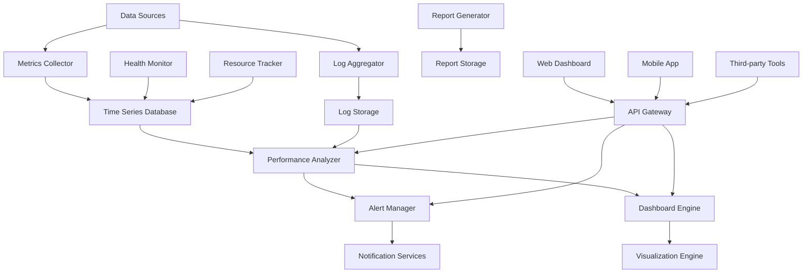

# Design Document

## Overview

The Performance Dashboard System is a comprehensive monitoring and analytics platform built with TypeScript/Node.js that provides real-time system monitoring, application performance metrics, resource tracking, and intelligent alerting. The design emphasizes scalability, real-time data processing, and customizable visualization capabilities.

## Architecture

### High-Level Architecture



### Service Architecture

The system follows a microservices architecture with event-driven communication:
1. **Metrics Collector**: Real-time system and application metrics collection
2. **Performance Analyzer**: Performance analysis and trend identification
3. **Health Monitor**: Service availability and health tracking
4. **Resource Tracker**: Resource utilization and capacity monitoring
5. **Alert Manager**: Intelligent alerting and notification system
6. **Dashboard Engine**: Customizable dashboard creation and management
7. **Log Aggregator**: Centralized log collection and analysis
8. **Report Generator**: Automated reporting and analytics

## Components and Interfaces

### Core API Endpoints

#### Metrics and Monitoring API
```typescript
// Metrics Collection
POST   /api/v1/metrics/collect           // Submit metrics data
GET    /api/v1/metrics/query             // Query metrics data
GET    /api/v1/metrics/series            // Get time series data
POST   /api/v1/metrics/batch             // Batch metrics submission

// Health Monitoring
GET    /api/v1/health/services           // Get service health status
POST   /api/v1/health/check              // Submit health check
GET    /api/v1/health/uptime             // Get uptime statistics
GET    /api/v1/health/availability       // Get availability metrics

// Performance Analysis
GET    /api/v1/performance/endpoints     // Get endpoint performance
GET    /api/v1/performance/database      // Get database performance
GET    /api/v1/performance/trends        // Get performance trends
POST   /api/v1/performance/analyze       // Trigger performance analysis
```

#### Dashboard and Visualization API
```typescript
// Dashboard Management
GET    /api/v1/dashboards                // List dashboards
POST   /api/v1/dashboards                // Create dashboard
GET    /api/v1/dashboards/:id            // Get dashboard details
PUT    /api/v1/dashboards/:id            // Update dashboard
DELETE /api/v1/dashboards/:id            // Delete dashboard

// Widget Management
GET    /api/v1/widgets                   // List available widgets
POST   /api/v1/widgets                   // Create custom widget
GET    /api/v1/widgets/:id/data          // Get widget data
PUT    /api/v1/widgets/:id               // Update widget configuration

// Visualization
GET    /api/v1/charts/data               // Get chart data
POST   /api/v1/charts/render             // Render chart
GET    /api/v1/visualizations/types      // Get available chart types
```

#### Alerting and Notification API
```typescript
// Alert Management
GET    /api/v1/alerts                    // List alerts
POST   /api/v1/alerts                    // Create alert rule
GET    /api/v1/alerts/:id                // Get alert details
PUT    /api/v1/alerts/:id                // Update alert rule
DELETE /api/v1/alerts/:id                // Delete alert rule

// Alert Conditions
POST   /api/v1/alerts/:id/conditions     // Add alert condition
GET    /api/v1/alerts/active             // Get active alerts
POST   /api/v1/alerts/:id/acknowledge    // Acknowledge alert
POST   /api/v1/alerts/:id/resolve        // Resolve alert

// Notifications
GET    /api/v1/notifications/channels    // Get notification channels
POST   /api/v1/notifications/channels    // Create notification channel
POST   /api/v1/notifications/send        // Send notification
GET    /api/v1/notifications/history     // Get notification history
```

### Data Models

#### Metric Data Model
```typescript
interface MetricData {
  id: string;
  name: string;
  value: number;
  timestamp: Date;
  
  // Metadata
  source: string;
  tags: Record<string, string>;
  unit: string;
  type: MetricType;
  
  // Aggregation
  aggregationType: AggregationType;
  interval: number;
  
  // Context
  serviceId?: string;
  instanceId?: string;
  environment: string;
  
  // Quality
  quality: DataQuality;
  confidence: number;
}

interface TimeSeriesData {
  metric: string;
  datapoints: DataPoint[];
  metadata: MetricMetadata;
  
  // Time range
  startTime: Date;
  endTime: Date;
  resolution: number;
  
  // Aggregation info
  aggregation: AggregationInfo;
  interpolation: InterpolationType;
}

interface DataPoint {
  timestamp: Date;
  value: number;
  quality: DataQuality;
  annotations?: Annotation[];
}

type MetricType = 'counter' | 'gauge' | 'histogram' | 'summary' | 'timer';
type AggregationType = 'sum' | 'avg' | 'min' | 'max' | 'count' | 'percentile';
type DataQuality = 'good' | 'uncertain' | 'bad' | 'missing';
```

#### Dashboard Model
```typescript
interface Dashboard {
  id: string;
  name: string;
  description: string;
  
  // Layout and Structure
  layout: DashboardLayout;
  widgets: Widget[];
  
  // Configuration
  refreshInterval: number;
  timeRange: TimeRange;
  filters: DashboardFilter[];
  
  // Access Control
  visibility: DashboardVisibility;
  permissions: DashboardPermission[];
  
  // Sharing
  isShared: boolean;
  shareSettings: ShareSettings;
  
  // Metadata
  createdBy: string;
  createdAt: Date;
  updatedAt: Date;
  tags: string[];
  category: string;
}

interface Widget {
  id: string;
  type: WidgetType;
  title: string;
  
  // Position and Size
  position: WidgetPosition;
  size: WidgetSize;
  
  // Data Configuration
  dataSource: DataSource;
  query: WidgetQuery;
  
  // Visualization
  visualization: VisualizationConfig;
  formatting: FormattingOptions;
  
  // Behavior
  refreshInterval: number;
  interactions: WidgetInteraction[];
  
  // Alerts
  alertRules: WidgetAlertRule[];
}

interface VisualizationConfig {
  chartType: ChartType;
  axes: AxisConfig[];
  series: SeriesConfig[];
  colors: ColorScheme;
  
  // Display Options
  showLegend: boolean;
  showGrid: boolean;
  showTooltips: boolean;
  
  // Thresholds
  thresholds: Threshold[];
  annotations: ChartAnnotation[];
}

type WidgetType = 'chart' | 'table' | 'metric' | 'gauge' | 'heatmap' | 'log' | 'alert';
type ChartType = 'line' | 'bar' | 'pie' | 'scatter' | 'area' | 'histogram' | 'candlestick';
type DashboardVisibility = 'private' | 'team' | 'organization' | 'public';
```

#### Alert Model
```typescript
interface AlertRule {
  id: string;
  name: string;
  description: string;
  
  // Conditions
  conditions: AlertCondition[];
  evaluation: EvaluationConfig;
  
  // Actions
  notifications: NotificationConfig[];
  escalation: EscalationConfig;
  
  // State
  state: AlertState;
  lastEvaluation: Date;
  lastTriggered?: Date;
  
  // Configuration
  severity: AlertSeverity;
  tags: string[];
  
  // Metadata
  createdBy: string;
  createdAt: Date;
  updatedAt: Date;
  isEnabled: boolean;
}

interface AlertCondition {
  id: string;
  type: ConditionType;
  
  // Query
  query: MetricQuery;
  aggregation: AggregationConfig;
  
  // Threshold
  operator: ComparisonOperator;
  threshold: number;
  
  // Time Window
  timeWindow: number;
  evaluationFrequency: number;
  
  // Advanced
  missingDataPolicy: MissingDataPolicy;
  anomalyDetection?: AnomalyDetectionConfig;
}

interface AlertInstance {
  id: string;
  ruleId: string;
  
  // State
  state: AlertInstanceState;
  triggeredAt: Date;
  resolvedAt?: Date;
  acknowledgedAt?: Date;
  acknowledgedBy?: string;
  
  // Context
  labels: Record<string, string>;
  annotations: Record<string, string>;
  value: number;
  
  // History
  stateHistory: AlertStateChange[];
  notifications: NotificationRecord[];
}

type AlertState = 'ok' | 'pending' | 'alerting' | 'no_data';
type AlertSeverity = 'critical' | 'warning' | 'info';
type ConditionType = 'threshold' | 'anomaly' | 'absence' | 'rate';
type ComparisonOperator = 'gt' | 'gte' | 'lt' | 'lte' | 'eq' | 'ne';
```

#### Performance Analysis Model
```typescript
interface PerformanceMetrics {
  id: string;
  timestamp: Date;
  
  // Application Performance
  responseTime: ResponseTimeMetrics;
  throughput: ThroughputMetrics;
  errorRate: ErrorRateMetrics;
  
  // System Performance
  cpu: CPUMetrics;
  memory: MemoryMetrics;
  disk: DiskMetrics;
  network: NetworkMetrics;
  
  // Database Performance
  database: DatabaseMetrics;
  
  // User Experience
  userExperience: UXMetrics;
  
  // Business Metrics
  business: BusinessMetrics;
}

interface ResponseTimeMetrics {
  average: number;
  median: number;
  p95: number;
  p99: number;
  min: number;
  max: number;
  
  // By Endpoint
  endpoints: EndpointMetrics[];
  
  // Trends
  trend: TrendData;
  anomalies: AnomalyData[];
}

interface ThroughputMetrics {
  requestsPerSecond: number;
  requestsPerMinute: number;
  totalRequests: number;
  
  // By Service
  services: ServiceThroughput[];
  
  // Capacity
  capacity: CapacityMetrics;
  utilization: number;
}

interface PerformanceAnalysis {
  id: string;
  timestamp: Date;
  timeRange: TimeRange;
  
  // Analysis Results
  bottlenecks: Bottleneck[];
  recommendations: Recommendation[];
  trends: TrendAnalysis[];
  
  // Scoring
  performanceScore: number;
  categoryScores: CategoryScore[];
  
  // Comparisons
  baseline: PerformanceBaseline;
  comparison: PerformanceComparison;
  
  // Predictions
  forecasts: PerformanceForecast[];
}
```

### Service Layer Architecture

#### Metrics Collector Service
```typescript
class MetricsCollectorService {
  // Metrics Collection
  async collectMetric(metric: MetricData): Promise<void>;
  async collectBatch(metrics: MetricData[]): Promise<void>;
  async queryMetrics(query: MetricQuery): Promise<TimeSeriesData[]>;
  
  // Configuration
  async configureCollector(config: CollectorConfig): Promise<void>;
  async getCollectorStatus(): Promise<CollectorStatus>;
  
  // Data Management
  async aggregateMetrics(timeRange: TimeRange): Promise<void>;
  async cleanupOldMetrics(retentionPolicy: RetentionPolicy): Promise<void>;
}
```

#### Performance Analyzer Service
```typescript
class PerformanceAnalyzerService {
  // Analysis
  async analyzePerformance(timeRange: TimeRange): Promise<PerformanceAnalysis>;
  async identifyBottlenecks(metrics: PerformanceMetrics[]): Promise<Bottleneck[]>;
  async generateRecommendations(analysis: PerformanceAnalysis): Promise<Recommendation[]>;
  
  // Trends and Forecasting
  async analyzeTrends(metric: string, timeRange: TimeRange): Promise<TrendAnalysis>;
  async forecastPerformance(metric: string, horizon: number): Promise<PerformanceForecast>;
  
  // Anomaly Detection
  async detectAnomalies(metrics: MetricData[]): Promise<AnomalyData[]>;
  async trainAnomalyModel(trainingData: MetricData[]): Promise<AnomalyModel>;
}
```

#### Dashboard Engine Service
```typescript
class DashboardEngineService {
  // Dashboard Management
  async createDashboard(dashboard: CreateDashboardDto): Promise<Dashboard>;
  async updateDashboard(id: string, updates: UpdateDashboardDto): Promise<Dashboard>;
  async deleteDashboard(id: string): Promise<void>;
  async getDashboard(id: string): Promise<Dashboard>;
  async listDashboards(filters: DashboardFilters): Promise<PaginatedResult<Dashboard>>;
  
  // Widget Management
  async addWidget(dashboardId: string, widget: Widget): Promise<Widget>;
  async updateWidget(widgetId: string, updates: UpdateWidgetDto): Promise<Widget>;
  async removeWidget(dashboardId: string, widgetId: string): Promise<void>;
  
  // Data Retrieval
  async getWidgetData(widgetId: string, timeRange: TimeRange): Promise<WidgetData>;
  async refreshDashboard(dashboardId: string): Promise<DashboardData>;
  
  // Sharing and Permissions
  async shareDashboard(dashboardId: string, shareConfig: ShareConfig): Promise<ShareResult>;
  async setPermissions(dashboardId: string, permissions: DashboardPermission[]): Promise<void>;
}
```

#### Alert Manager Service
```typescript
class AlertManagerService {
  // Alert Rules
  async createAlertRule(rule: CreateAlertRuleDto): Promise<AlertRule>;
  async updateAlertRule(id: string, updates: UpdateAlertRuleDto): Promise<AlertRule>;
  async deleteAlertRule(id: string): Promise<void>;
  async getAlertRule(id: string): Promise<AlertRule>;
  async listAlertRules(filters: AlertRuleFilters): Promise<PaginatedResult<AlertRule>>;
  
  // Alert Evaluation
  async evaluateAlerts(): Promise<EvaluationResult[]>;
  async evaluateAlertRule(ruleId: string): Promise<EvaluationResult>;
  
  // Alert Management
  async acknowledgeAlert(alertId: string, userId: string): Promise<void>;
  async resolveAlert(alertId: string, userId: string): Promise<void>;
  async getActiveAlerts(): Promise<AlertInstance[]>;
  
  // Notifications
  async sendNotification(alert: AlertInstance): Promise<NotificationResult>;
  async configureNotificationChannel(channel: NotificationChannel): Promise<void>;
}
```

## Correctness Properties

*A property is a characteristic or behavior that should hold true across all valid executions of a system-essentially, a formal statement about what the system should do. Properties serve as the bridge between human-readable specifications and machine-verifiable correctness guarantees.*

### Property Reflection

After analyzing the acceptance criteria, I identified several properties that can be consolidated:
- Multiple metrics collection properties can be combined into comprehensive data integrity properties
- Alert condition properties can be unified into alert behavior properties  
- Dashboard and widget properties can be consolidated into dashboard functionality properties
- Performance analysis properties can be combined into analysis accuracy properties

### Core Properties

**Property 1: Metrics collection data integrity**
*For any* system metric collected, the stored data should preserve all required fields (timestamp, value, source, tags) and maintain data quality indicators
**Validates: Requirements 1.1, 1.2, 1.5**

**Property 2: Health monitoring accuracy**
*For any* service being monitored, availability calculations should be accurate and outage detection should trigger within the configured time window
**Validates: Requirements 1.3, 1.4, 1.6**

**Property 3: Performance measurement consistency**
*For any* API endpoint or database query, performance metrics (response time, throughput, error rate) should be measured consistently and accurately across all monitoring intervals
**Validates: Requirements 2.1, 2.2, 2.3, 2.5**

**Property 4: Resource tracking accuracy**
*For any* monitored resource (CPU, memory, disk, network), utilization measurements should be accurate and resource usage trends should be calculated correctly
**Validates: Requirements 3.1, 3.3, 3.5**

**Property 5: Dashboard functionality integrity**
*For any* dashboard widget, data queries should return results matching the configured filters and time ranges, and role-based permissions should be enforced correctly
**Validates: Requirements 4.2, 4.3, 4.4, 4.5**

**Property 6: Alert condition evaluation**
*For any* alert rule with defined thresholds, condition evaluation should trigger alerts correctly when thresholds are exceeded and resolve alerts when conditions return to normal
**Validates: Requirements 5.1, 5.2, 5.4, 5.5**

**Property 7: Log aggregation completeness**
*For any* configured log source, all logs should be collected, parsed correctly for structured data, and be searchable with accurate filtering
**Validates: Requirements 6.1, 6.2, 6.3, 6.5**

**Property 8: Report generation accuracy**
*For any* performance report, generated data should accurately reflect the underlying metrics and scheduled reports should be delivered on time
**Validates: Requirements 7.1, 7.2, 7.3, 7.5**

**Property 9: User experience metrics tracking**
*For any* user interaction or business event, metrics should be tracked accurately and calculations for conversion rates and engagement should be correct
**Validates: Requirements 8.1, 8.2, 8.3, 8.5**

**Property 10: Security monitoring completeness**
*For any* security event or compliance metric, data should be tracked accurately and security alerts should be triggered according to configured rules
**Validates: Requirements 9.1, 9.3, 9.5, 9.6**

**Property 11: API and integration functionality**
*For any* API request or webhook event, operations should complete successfully and return accurate data while maintaining proper authentication and rate limiting
**Validates: Requirements 10.1, 10.2, 10.3, 10.5**

## Error Handling

### Metrics Collection Errors
- **Data Validation Failures**: Invalid metric data should be rejected with descriptive error messages
- **Storage Failures**: Failed metric storage should trigger retry mechanisms and fallback storage
- **Network Issues**: Collector should handle network interruptions gracefully with buffering
- **Resource Exhaustion**: System should handle high metric volumes with backpressure and sampling

### Dashboard and Visualization Errors
- **Query Failures**: Failed data queries should display error states in widgets
- **Rendering Errors**: Chart rendering failures should show fallback visualizations
- **Permission Errors**: Unauthorized access should return appropriate error responses
- **Configuration Errors**: Invalid dashboard configurations should be validated and rejected

### Alerting System Errors
- **Evaluation Failures**: Failed alert evaluations should be logged and retried
- **Notification Failures**: Failed notifications should trigger escalation procedures
- **Threshold Errors**: Invalid alert conditions should be validated during creation
- **State Inconsistencies**: Alert state conflicts should be resolved with conflict resolution

## Testing Strategy

### Unit Testing
- Test individual service methods with specific examples and edge cases
- Validate data transformation and calculation logic
- Test error handling and boundary conditions
- Verify configuration validation and business rules

### Property-Based Testing
- Use a TypeScript property testing library (fast-check) with minimum 100 iterations per test
- Test universal properties across all valid inputs and configurations
- Validate data integrity and consistency across system operations
- Test performance characteristics under various load conditions

**Property Test Configuration:**
- Each property test must reference its design document property
- Tag format: **Feature: performance-dashboard, Property {number}: {property_text}**
- Tests should generate realistic metric data, dashboard configurations, and alert conditions
- Property tests should validate system behavior across different time ranges and data volumes

### Integration Testing
- Test complete monitoring workflows from data collection to visualization
- Validate alert workflows from condition evaluation to notification delivery
- Test dashboard functionality with real-time data updates
- Verify third-party integrations and data source connections

The dual testing approach ensures both specific functionality works correctly (unit tests) and universal system properties hold across all scenarios (property tests).