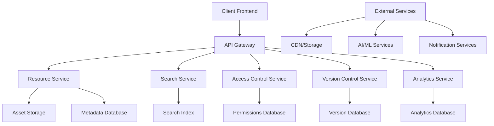

# Design Document

## Overview

The Resource Library System is a comprehensive digital asset management and knowledge base platform built with Node.js/TypeScript that enables content organization, search and discovery, access control, and collaborative content management. The design emphasizes scalability, security, and seamless integration with existing portfolio infrastructure.

## Architecture

### High-Level Architecture



### Service Architecture

The system follows a microservices architecture:
1. **Resource Service**: Core asset management and organization
2. **Search Service**: Full-text search and discovery
3. **Access Control Service**: Permissions and security
4. **Version Control Service**: Content versioning and collaboration
5. **Analytics Service**: Usage tracking and reporting
6. **Content Editor Service**: Rich content creation and editing
7. **Download Service**: Secure file delivery and tracking

## Components and Interfaces

### Core API Endpoints

#### Resource Management API
```typescript
// Asset Operations
GET    /api/v1/resources                 // List resources with filters
GET    /api/v1/resources/:id            // Get resource details
POST   /api/v1/resources                // Upload new resource
PUT    /api/v1/resources/:id            // Update resource
DELETE /api/v1/resources/:id            // Delete resource
POST   /api/v1/resources/bulk           // Bulk upload

// Organization
GET    /api/v1/folders                  // List folder structure
POST   /api/v1/folders                  // Create folder
PUT    /api/v1/folders/:id              // Update folder
DELETE /api/v1/folders/:id              // Delete folder
POST   /api/v1/resources/:id/move       // Move resource

// Categorization
GET    /api/v1/categories               // List categories
POST   /api/v1/categories               // Create category
GET    /api/v1/tags                     // List tags
POST   /api/v1/resources/:id/tags       // Add tags to resource
```

#### Search and Discovery API
```typescript
// Search Operations
GET    /api/v1/search                   // Search resources
GET    /api/v1/search/suggestions       // Get search suggestions
GET    /api/v1/search/autocomplete      // Autocomplete queries
POST   /api/v1/search/advanced          // Advanced search with filters

// Analytics
GET    /api/v1/search/analytics         // Search analytics
GET    /api/v1/search/popular           // Popular searches
GET    /api/v1/resources/trending       // Trending resources
```

#### Access Control API
```typescript
// Permissions
GET    /api/v1/resources/:id/permissions // Get resource permissions
PUT    /api/v1/resources/:id/permissions // Update permissions
POST   /api/v1/resources/:id/share       // Share resource
GET    /api/v1/resources/shared          // List shared resources

// Access Management
POST   /api/v1/access/validate           // Validate access
GET    /api/v1/access/logs               // Access logs
POST   /api/v1/access/temporary          // Create temporary access
```

#### Version Control API
```typescript
// Version Management
GET    /api/v1/resources/:id/versions    // List resource versions
GET    /api/v1/resources/:id/versions/:version // Get specific version
POST   /api/v1/resources/:id/versions    // Create new version
GET    /api/v1/resources/:id/diff        // Compare versions
POST   /api/v1/resources/:id/rollback    // Rollback to version

// Collaboration
POST   /api/v1/resources/:id/lock        // Lock for editing
DELETE /api/v1/resources/:id/lock        // Release lock
GET    /api/v1/resources/:id/conflicts   // Get merge conflicts
POST   /api/v1/resources/:id/merge       // Merge changes
```

### Data Models

#### Resource Model
```typescript
interface Resource {
  id: string;
  name: string;
  description: string;
  type: ResourceType;
  
  // File Information
  filename: string;
  mimeType: string;
  size: number;
  checksum: string;
  
  // Storage
  storageUrl: string;
  thumbnailUrl?: string;
  previewUrl?: string;
  
  // Organization
  folderId?: string;
  categories: Category[];
  tags: Tag[];
  
  // Content
  content?: string; // For text-based resources
  metadata: ResourceMetadata;
  
  // Access Control
  visibility: VisibilityLevel;
  permissions: Permission[];
  
  // Versioning
  version: number;
  versionHistory: VersionInfo[];
  
  // Analytics
  downloadCount: number;
  viewCount: number;
  rating: number;
  
  // Timestamps
  createdAt: Date;
  updatedAt: Date;
  lastAccessedAt: Date;
  
  // Ownership
  createdBy: string;
  updatedBy: string;
}

interface ResourceMetadata {
  title?: string;
  author?: string;
  keywords: string[];
  language?: string;
  format?: string;
  
  // Media-specific
  duration?: number; // For videos/audio
  dimensions?: { width: number; height: number }; // For images
  pageCount?: number; // For documents
  
  // Code-specific
  programmingLanguage?: string;
  framework?: string;
  dependencies?: string[];
  
  // Custom fields
  customFields: Record<string, any>;
}

type ResourceType = 'document' | 'image' | 'video' | 'audio' | 'code' | 'archive' | 'other';
type VisibilityLevel = 'public' | 'registered' | 'premium' | 'private';
```

#### Folder Structure Model
```typescript
interface Folder {
  id: string;
  name: string;
  description?: string;
  
  // Hierarchy
  parentId?: string;
  path: string;
  level: number;
  
  // Contents
  subfolders: Folder[];
  resources: Resource[];
  
  // Access Control
  permissions: Permission[];
  inheritPermissions: boolean;
  
  // Metadata
  createdAt: Date;
  updatedAt: Date;
  createdBy: string;
}

interface Category {
  id: string;
  name: string;
  description?: string;
  color?: string;
  icon?: string;
  
  // Hierarchy
  parentId?: string;
  children: Category[];
  
  // Usage
  resourceCount: number;
  isActive: boolean;
  
  // Metadata
  createdAt: Date;
  updatedAt: Date;
}

interface Tag {
  id: string;
  name: string;
  description?: string;
  color?: string;
  
  // Relationships
  synonyms: string[];
  relatedTags: string[];
  
  // Usage
  usageCount: number;
  isPopular: boolean;
  
  // Metadata
  createdAt: Date;
  updatedAt: Date;
}
```

#### Access Control Model
```typescript
interface Permission {
  id: string;
  resourceId: string;
  
  // Subject (who has permission)
  subjectType: 'user' | 'group' | 'role' | 'public';
  subjectId?: string;
  
  // Permission details
  actions: PermissionAction[];
  conditions?: PermissionCondition[];
  
  // Temporal
  expiresAt?: Date;
  isActive: boolean;
  
  // Metadata
  grantedBy: string;
  grantedAt: Date;
}

interface TemporaryAccess {
  id: string;
  resourceId: string;
  token: string;
  
  // Access details
  permissions: PermissionAction[];
  maxDownloads?: number;
  currentDownloads: number;
  
  // Temporal
  expiresAt: Date;
  isActive: boolean;
  
  // Tracking
  createdBy: string;
  createdAt: Date;
  lastUsedAt?: Date;
}

type PermissionAction = 'read' | 'write' | 'delete' | 'share' | 'download' | 'comment';

interface PermissionCondition {
  type: 'ip_range' | 'time_range' | 'location' | 'device_type';
  value: any;
}
```

#### Version Control Model
```typescript
interface VersionInfo {
  version: number;
  resourceId: string;
  
  // Content
  contentHash: string;
  storageUrl: string;
  size: number;
  
  // Changes
  changeType: ChangeType;
  changeDescription?: string;
  changedFields: string[];
  
  // Metadata
  createdBy: string;
  createdAt: Date;
  
  // Relationships
  parentVersion?: number;
  mergedFromVersions?: number[];
}

interface ResourceLock {
  id: string;
  resourceId: string;
  
  // Lock details
  lockedBy: string;
  lockType: LockType;
  reason?: string;
  
  // Temporal
  lockedAt: Date;
  expiresAt: Date;
  isActive: boolean;
}

interface MergeConflict {
  id: string;
  resourceId: string;
  
  // Conflict details
  baseVersion: number;
  version1: number;
  version2: number;
  
  // Conflict data
  conflictingFields: ConflictField[];
  
  // Resolution
  isResolved: boolean;
  resolvedBy?: string;
  resolvedAt?: Date;
  
  // Metadata
  createdAt: Date;
}

interface ConflictField {
  fieldPath: string;
  baseValue: any;
  value1: any;
  value2: any;
  resolvedValue?: any;
}

type ChangeType = 'create' | 'update' | 'delete' | 'move' | 'rename' | 'merge';
type LockType = 'exclusive' | 'shared' | 'checkout';
```

### Service Layer Architecture

#### Resource Service
```typescript
class ResourceService {
  // Resource Management
  async createResource(resourceData: CreateResourceDto): Promise<Resource>;
  async updateResource(id: string, updates: UpdateResourceDto): Promise<Resource>;
  async deleteResource(id: string): Promise<void>;
  async getResource(id: string): Promise<Resource>;
  async listResources(filters: ResourceFilters): Promise<PaginatedResult<Resource>>;
  
  // File Operations
  async uploadFile(file: FileUpload, metadata: ResourceMetadata): Promise<Resource>;
  async downloadFile(id: string, userId: string): Promise<FileDownload>;
  async generateThumbnail(id: string): Promise<string>;
  async extractMetadata(file: FileUpload): Promise<ResourceMetadata>;
  
  // Organization
  async moveResource(id: string, folderId: string): Promise<Resource>;
  async copyResource(id: string, targetFolderId: string): Promise<Resource>;
  async bulkUpload(files: FileUpload[], folderId: string): Promise<Resource[]>;
  
  // Categorization
  async addTags(id: string, tags: string[]): Promise<Resource>;
  async removeTags(id: string, tags: string[]): Promise<Resource>;
  async categorizeResource(id: string, categories: string[]): Promise<Resource>;
}
```

#### Search Service
```typescript
class SearchService {
  // Search Operations
  async searchResources(query: SearchQuery): Promise<SearchResult<Resource>>;
  async advancedSearch(criteria: AdvancedSearchCriteria): Promise<SearchResult<Resource>>;
  async getSuggestions(partialQuery: string): Promise<string[]>;
  async getAutocomplete(query: string): Promise<AutocompleteResult[]>;
  
  // Indexing
  async indexResource(resource: Resource): Promise<void>;
  async updateIndex(id: string, resource: Resource): Promise<void>;
  async removeFromIndex(id: string): Promise<void>;
  async reindexAll(): Promise<void>;
  
  // Analytics
  async trackSearch(query: string, results: SearchResult<Resource>, userId?: string): Promise<void>;
  async getSearchAnalytics(timeRange: TimeRange): Promise<SearchAnalytics>;
  async getPopularSearches(limit: number): Promise<PopularSearch[]>;
  async getTrendingResources(timeRange: TimeRange): Promise<Resource[]>;
}
```

#### Access Control Service
```typescript
class AccessControlService {
  // Permission Management
  async grantPermission(resourceId: string, permission: CreatePermissionDto): Promise<Permission>;
  async revokePermission(permissionId: string): Promise<void>;
  async updatePermission(permissionId: string, updates: UpdatePermissionDto): Promise<Permission>;
  async getResourcePermissions(resourceId: string): Promise<Permission[]>;
  
  // Access Validation
  async validateAccess(resourceId: string, userId: string, action: PermissionAction): Promise<boolean>;
  async getAccessibleResources(userId: string, filters: ResourceFilters): Promise<Resource[]>;
  async checkBulkAccess(resourceIds: string[], userId: string, action: PermissionAction): Promise<AccessResult[]>;
  
  // Temporary Access
  async createTemporaryAccess(resourceId: string, config: TemporaryAccessConfig): Promise<TemporaryAccess>;
  async validateTemporaryAccess(token: string): Promise<TemporaryAccess>;
  async revokeTemporaryAccess(token: string): Promise<void>;
  
  // Audit
  async logAccess(resourceId: string, userId: string, action: string, result: boolean): Promise<void>;
  async getAccessLogs(filters: AccessLogFilters): Promise<AccessLog[]>;
}
```

#### Version Control Service
```typescript
class VersionControlService {
  // Version Management
  async createVersion(resourceId: string, changes: ResourceChanges): Promise<VersionInfo>;
  async getVersionHistory(resourceId: string): Promise<VersionInfo[]>;
  async getVersion(resourceId: string, version: number): Promise<Resource>;
  async compareVersions(resourceId: string, version1: number, version2: number): Promise<VersionDiff>;
  async rollbackToVersion(resourceId: string, version: number): Promise<Resource>;
  
  // Locking
  async lockResource(resourceId: string, userId: string, lockType: LockType): Promise<ResourceLock>;
  async unlockResource(resourceId: string, userId: string): Promise<void>;
  async getLockStatus(resourceId: string): Promise<ResourceLock | null>;
  async breakLock(resourceId: string, adminUserId: string): Promise<void>;
  
  // Merging
  async detectConflicts(resourceId: string, version1: number, version2: number): Promise<MergeConflict[]>;
  async resolveConflict(conflictId: string, resolution: ConflictResolution): Promise<void>;
  async mergeVersions(resourceId: string, baseVersion: number, targetVersion: number): Promise<Resource>;
  
  // Branching (Advanced)
  async createBranch(resourceId: string, branchName: string, fromVersion: number): Promise<Branch>;
  async mergeBranch(resourceId: string, branchName: string, targetBranch: string): Promise<MergeResult>;
  async listBranches(resourceId: string): Promise<Branch[]>;
}
```

## Correctness Properties

*A property is a characteristic or behavior that should hold true across all valid executions of a system-essentially, a formal statement about what the system should do. Properties serve as the bridge between human-readable specifications and machine-verifiable correctness guarantees.*

Based on the prework analysis, here are the key correctness properties:

### Property 1: File Upload Validation
*For any* file upload request, the system should accept files that match supported types and sizes, and reject files that don't meet validation criteria
**Validates: Requirements 1.1, 1.2**

### Property 2: Folder Hierarchy Integrity
*For any* folder operation (create, move, delete), the hierarchical structure should remain consistent with no orphaned resources or circular references
**Validates: Requirements 1.3**

### Property 3: Metadata Generation Consistency
*For any* uploaded asset, metadata should be automatically generated and thumbnails created when applicable for supported file types
**Validates: Requirements 1.4**

### Property 4: Bulk Operation Integrity
*For any* bulk upload or batch operation, either all operations succeed or the system maintains a consistent state with proper error reporting
**Validates: Requirements 1.6**

### Property 5: Tag Assignment Preservation
*For any* resource, assigned tags and categories should be preserved across all operations and remain accessible through search and filtering
**Validates: Requirements 2.1, 2.2**

### Property 6: Category Hierarchy Consistency
*For any* category hierarchy operation, the nested structure should remain valid with proper parent-child relationships
**Validates: Requirements 2.4**

### Property 7: Search Result Accuracy
*For any* search query, all returned results should contain the search terms in their content, metadata, or tags
**Validates: Requirements 3.1**

### Property 8: Filter Application Correctness
*For any* search with filters applied, all results should match the specified filter criteria (type, category, date, author)
**Validates: Requirements 3.2**

### Property 9: Search Ranking Consistency
*For any* identical search query, results should be ranked consistently based on relevance and popularity algorithms
**Validates: Requirements 3.4**

### Property 10: Access Control Enforcement
*For any* resource access attempt, users should only be able to access resources for which they have appropriate permissions
**Validates: Requirements 4.1, 4.2**

### Property 11: Temporary Access Validation
*For any* temporary access token, access should be granted only within the specified time limits and usage constraints
**Validates: Requirements 4.3**

### Property 12: Access Logging Completeness
*For any* resource access attempt, the event should be logged with complete information (user, resource, action, timestamp, result)
**Validates: Requirements 4.4**

### Property 13: Version History Preservation
*For any* resource update, the previous version should be preserved and remain accessible through version history
**Validates: Requirements 5.1, 5.2**

### Property 14: Version Comparison Accuracy
*For any* two versions of a resource, the diff should accurately show all changes between the versions
**Validates: Requirements 5.3**

### Property 15: Concurrent Edit Conflict Detection
*For any* concurrent editing scenario, conflicts should be detected and handled appropriately without data loss
**Validates: Requirements 5.4**

### Property 16: Rollback Operation Integrity
*For any* rollback operation, the resource should be restored to the exact state of the specified previous version
**Validates: Requirements 5.5**

### Property 17: Download Analytics Accuracy
*For any* resource download or access, the event should be accurately recorded and reflected in usage analytics
**Validates: Requirements 6.1, 6.2**

### Property 18: Rate Limiting Enforcement
*For any* user or IP address, download rate limits should be enforced correctly without affecting legitimate usage
**Validates: Requirements 6.3**

### Property 19: Content Format Preservation
*For any* rich text content with markdown or HTML, the formatting should be preserved accurately during storage and retrieval
**Validates: Requirements 7.1**

### Property 20: Collaborative Edit Synchronization
*For any* collaborative editing session, changes should be synchronized correctly across all participants without conflicts
**Validates: Requirements 7.3**

### Property 21: API Operation Consistency
*For any* API operation, the response should match the documented API contract and maintain data consistency
**Validates: Requirements 9.1**

### Property 22: Webhook Delivery Reliability
*For any* resource change event, registered webhooks should be triggered with accurate event data
**Validates: Requirements 9.3**

### Property 23: Syndication Content Integrity
*For any* RSS feed or content syndication, the exported content should maintain attribution and licensing information
**Validates: Requirements 10.1, 10.4**

### Property 24: Export Format Accuracy
*For any* content export operation, the exported content should be accurately converted to the target format without data loss
**Validates: Requirements 10.5**

## Error Handling

### File Upload Errors
- Invalid file type rejection with clear error messages
- File size limit enforcement with progress feedback
- Storage failure handling with retry mechanisms
- Metadata extraction error recovery

### Access Control Errors
- Permission denied responses with appropriate HTTP status codes
- Token expiration handling with refresh mechanisms
- Rate limiting responses with retry-after headers
- Authentication failure handling

### Version Control Errors
- Merge conflict detection and resolution workflows
- Lock timeout handling and automatic release
- Concurrent modification detection and prevention
- Rollback failure recovery

### Search and Discovery Errors
- Search index unavailability fallback mechanisms
- Query parsing error handling with suggestions
- Result ranking failure graceful degradation
- Analytics collection error isolation

## Testing Strategy

### Unit Testing
- File upload and validation logic
- Permission calculation and enforcement
- Version comparison and merging algorithms
- Search query parsing and execution
- Metadata extraction and processing

### Property-Based Testing
- Use **fast-check** library for TypeScript property testing
- Each property test runs minimum 100 iterations
- Properties validate universal correctness across all inputs
- Test data generators create realistic resource scenarios
- Property tests complement unit tests for comprehensive coverage

### Integration Testing
- End-to-end resource management workflows
- Multi-user collaboration scenarios
- Search and discovery user journeys
- Access control and permission inheritance
- Version control and conflict resolution

### Performance Testing
- Large file upload and processing
- Concurrent user access patterns
- Search performance with large datasets
- Database query optimization validation
- CDN and caching effectiveness