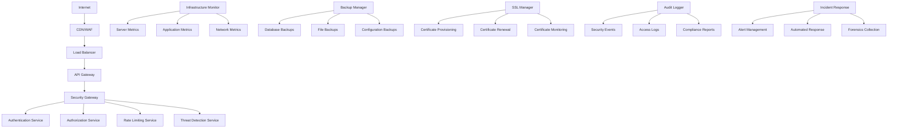

# Design Document

## Overview

The Security & Infrastructure system is a comprehensive security and monitoring platform built with Node.js/TypeScript that provides enterprise-grade security, threat detection, infrastructure monitoring, and compliance management. The design emphasizes defense-in-depth, zero-trust architecture, and automated incident response.

## Architecture

### High-Level Architecture



### Security Architecture Layers

The system implements a multi-layered security architecture:
1. **Perimeter Security**: WAF, DDoS protection, and network firewalls
2. **Application Security**: Input validation, authentication, and authorization
3. **Data Security**: Encryption at rest and in transit, key management
4. **Infrastructure Security**: Server hardening, monitoring, and patch management
5. **Operational Security**: Incident response, audit logging, and compliance

## Components and Interfaces

### Core Security Services

#### Authentication Service
```typescript
interface AuthenticationService {
  // Multi-Factor Authentication
  enableMFA(userId: string, method: MFAMethod): Promise<MFASetup>;
  verifyMFA(userId: string, token: string): Promise<MFAResult>;
  
  // Password Management
  validatePassword(password: string): Promise<PasswordValidation>;
  hashPassword(password: string): Promise<string>;
  verifyPassword(password: string, hash: string): Promise<boolean>;
  
  // Session Management
  createSession(userId: string, metadata: SessionMetadata): Promise<Session>;
  validateSession(sessionId: string): Promise<SessionValidation>;
  revokeSession(sessionId: string): Promise<void>;
  
  // JWT Token Management
  generateJWT(payload: JWTPayload): Promise<string>;
  verifyJWT(token: string): Promise<JWTValidation>;
  refreshJWT(refreshToken: string): Promise<TokenPair>;
}

interface MFAMethod {
  type: 'totp' | 'sms' | 'email' | 'hardware';
  identifier: string; // phone, email, or device ID
}

interface Session {
  id: string;
  userId: string;
  ipAddress: string;
  userAgent: string;
  createdAt: Date;
  expiresAt: Date;
  isActive: boolean;
  metadata: SessionMetadata;
}
```

#### Authorization Service
```typescript
interface AuthorizationService {
  // Role-Based Access Control
  assignRole(userId: string, role: Role): Promise<void>;
  revokeRole(userId: string, roleId: string): Promise<void>;
  getUserRoles(userId: string): Promise<Role[]>;
  
  // Permission Management
  checkPermission(userId: string, resource: string, action: string): Promise<boolean>;
  grantPermission(userId: string, permission: Permission): Promise<void>;
  revokePermission(userId: string, permissionId: string): Promise<void>;
  
  // Resource Access Control
  createAccessPolicy(policy: AccessPolicy): Promise<AccessPolicy>;
  evaluateAccess(request: AccessRequest): Promise<AccessDecision>;
  
  // Audit and Compliance
  logAccessAttempt(request: AccessRequest, decision: AccessDecision): Promise<void>;
  generateAccessReport(timeRange: TimeRange): Promise<AccessReport>;
}

interface Role {
  id: string;
  name: string;
  description: string;
  permissions: Permission[];
  isActive: boolean;
  createdAt: Date;
}

interface Permission {
  id: string;
  resource: string;
  action: string;
  conditions?: AccessCondition[];
}

interface AccessPolicy {
  id: string;
  name: string;
  rules: PolicyRule[];
  effect: 'allow' | 'deny';
  priority: number;
}
```

#### Rate Limiting Service
```typescript
interface RateLimitingService {
  // Rate Limit Configuration
  createRateLimit(config: RateLimitConfig): Promise<RateLimit>;
  updateRateLimit(id: string, config: Partial<RateLimitConfig>): Promise<RateLimit>;
  deleteRateLimit(id: string): Promise<void>;
  
  // Rate Limit Enforcement
  checkRateLimit(key: string, identifier: string): Promise<RateLimitResult>;
  incrementCounter(key: string, identifier: string): Promise<void>;
  resetCounter(key: string, identifier: string): Promise<void>;
  
  // Analytics and Monitoring
  getRateLimitMetrics(timeRange: TimeRange): Promise<RateLimitMetrics>;
  getTopBlockedIPs(limit: number): Promise<BlockedIP[]>;
  
  // Dynamic Rate Limiting
  adjustRateLimit(key: string, factor: number): Promise<void>;
  enableEmergencyMode(duration: Duration): Promise<void>;
}

interface RateLimitConfig {
  key: string; // endpoint, user, IP, etc.
  windowSize: Duration;
  maxRequests: number;
  blockDuration?: Duration;
  skipSuccessfulRequests?: boolean;
  skipFailedRequests?: boolean;
}

interface RateLimitResult {
  allowed: boolean;
  limit: number;
  remaining: number;
  resetTime: Date;
  retryAfter?: number;
}
```

#### Threat Detection Service
```typescript
interface ThreatDetectionService {
  // Attack Pattern Detection
  detectSQLInjection(input: string): Promise<ThreatAssessment>;
  detectXSS(input: string): Promise<ThreatAssessment>;
  detectCSRF(request: HTTPRequest): Promise<ThreatAssessment>;
  
  // Behavioral Analysis
  analyzeUserBehavior(userId: string, activity: UserActivity): Promise<BehaviorAssessment>;
  detectAnomalousActivity(pattern: ActivityPattern): Promise<AnomalyDetection>;
  
  // IP Reputation and Geolocation
  checkIPReputation(ipAddress: string): Promise<IPReputation>;
  validateGeolocation(ipAddress: string, allowedCountries: string[]): Promise<GeolocationResult>;
  
  // DDoS Detection and Mitigation
  detectDDoSAttack(metrics: TrafficMetrics): Promise<DDoSAssessment>;
  activateDDoSMitigation(attack: DDoSAttack): Promise<MitigationResult>;
  
  // Threat Intelligence Integration
  updateThreatFeeds(): Promise<void>;
  queryThreatIntelligence(indicator: string): Promise<ThreatIntelligence>;
  
  // Automated Response
  executeResponsePlaybook(threat: DetectedThreat): Promise<ResponseResult>;
  blockMaliciousIP(ipAddress: string, duration: Duration): Promise<void>;
}

interface ThreatAssessment {
  threatLevel: 'low' | 'medium' | 'high' | 'critical';
  confidence: number;
  indicators: ThreatIndicator[];
  recommendedAction: 'allow' | 'block' | 'challenge' | 'monitor';
}

interface DetectedThreat {
  id: string;
  type: ThreatType;
  severity: ThreatSeverity;
  source: string;
  target: string;
  indicators: ThreatIndicator[];
  detectedAt: Date;
  status: 'active' | 'mitigated' | 'false_positive';
}
```

### Infrastructure Monitoring

#### Infrastructure Monitor Service
```typescript
interface InfrastructureMonitorService {
  // System Metrics Collection
  collectSystemMetrics(): Promise<SystemMetrics>;
  collectApplicationMetrics(): Promise<ApplicationMetrics>;
  collectNetworkMetrics(): Promise<NetworkMetrics>;
  
  // Health Checks
  performHealthCheck(service: string): Promise<HealthCheckResult>;
  registerHealthCheck(config: HealthCheckConfig): Promise<void>;
  
  // Alerting and Notifications
  createAlert(alert: Alert): Promise<Alert>;
  evaluateAlertConditions(): Promise<void>;
  sendNotification(notification: Notification): Promise<void>;
  
  // Performance Analysis
  analyzePerformanceTrends(timeRange: TimeRange): Promise<PerformanceAnalysis>;
  predictCapacityNeeds(service: string): Promise<CapacityPrediction>;
  
  // Dashboard and Visualization
  generateDashboard(config: DashboardConfig): Promise<Dashboard>;
  exportMetrics(format: 'json' | 'csv' | 'prometheus'): Promise<string>;
}

interface SystemMetrics {
  timestamp: Date;
  cpu: CPUMetrics;
  memory: MemoryMetrics;
  disk: DiskMetrics;
  network: NetworkMetrics;
  processes: ProcessMetrics[];
}

interface CPUMetrics {
  usage: number; // percentage
  loadAverage: number[];
  coreCount: number;
  temperature?: number;
}

interface MemoryMetrics {
  total: number;
  used: number;
  free: number;
  cached: number;
  buffers: number;
  swapTotal: number;
  swapUsed: number;
}

interface Alert {
  id: string;
  name: string;
  condition: AlertCondition;
  severity: 'info' | 'warning' | 'error' | 'critical';
  status: 'active' | 'resolved' | 'suppressed';
  createdAt: Date;
  resolvedAt?: Date;
  notifications: NotificationChannel[];
}
```

#### Backup Manager Service
```typescript
interface BackupManagerService {
  // Backup Operations
  createBackup(config: BackupConfig): Promise<Backup>;
  restoreBackup(backupId: string, target: RestoreTarget): Promise<RestoreResult>;
  verifyBackup(backupId: string): Promise<BackupVerification>;
  
  // Backup Scheduling
  scheduleBackup(schedule: BackupSchedule): Promise<ScheduledBackup>;
  cancelScheduledBackup(scheduleId: string): Promise<void>;
  
  // Backup Management
  listBackups(filters: BackupFilters): Promise<Backup[]>;
  deleteBackup(backupId: string): Promise<void>;
  archiveBackup(backupId: string): Promise<void>;
  
  // Disaster Recovery
  createRecoveryPlan(plan: RecoveryPlan): Promise<RecoveryPlan>;
  executeRecoveryPlan(planId: string): Promise<RecoveryExecution>;
  testRecoveryProcedure(planId: string): Promise<RecoveryTest>;
  
  // Backup Analytics
  getBackupMetrics(timeRange: TimeRange): Promise<BackupMetrics>;
  generateBackupReport(): Promise<BackupReport>;
}

interface BackupConfig {
  name: string;
  type: 'database' | 'files' | 'configuration' | 'full_system';
  source: BackupSource;
  destination: BackupDestination;
  compression: boolean;
  encryption: EncryptionConfig;
  retention: RetentionPolicy;
}

interface Backup {
  id: string;
  name: string;
  type: BackupType;
  size: number;
  status: 'in_progress' | 'completed' | 'failed' | 'corrupted';
  createdAt: Date;
  completedAt?: Date;
  checksum: string;
  metadata: BackupMetadata;
}
```

#### SSL Manager Service
```typescript
interface SSLManagerService {
  // Certificate Provisioning
  provisionCertificate(domain: string, options: CertificateOptions): Promise<Certificate>;
  renewCertificate(certificateId: string): Promise<Certificate>;
  revokeCertificate(certificateId: string, reason: RevocationReason): Promise<void>;
  
  // Certificate Management
  listCertificates(filters: CertificateFilters): Promise<Certificate[]>;
  getCertificate(certificateId: string): Promise<Certificate>;
  updateCertificate(certificateId: string, updates: CertificateUpdates): Promise<Certificate>;
  
  // Certificate Monitoring
  checkCertificateExpiry(): Promise<ExpiryReport>;
  validateCertificateChain(certificateId: string): Promise<ChainValidation>;
  scanCertificateSecurity(certificateId: string): Promise<SecurityScan>;
  
  // Automated Management
  enableAutoRenewal(certificateId: string): Promise<void>;
  configureRenewalNotifications(config: NotificationConfig): Promise<void>;
  
  // Certificate Analytics
  getCertificateMetrics(timeRange: TimeRange): Promise<CertificateMetrics>;
  generateComplianceReport(): Promise<ComplianceReport>;
}

interface Certificate {
  id: string;
  domain: string;
  subjectAlternativeNames: string[];
  issuer: string;
  serialNumber: string;
  fingerprint: string;
  
  // Validity
  validFrom: Date;
  validTo: Date;
  daysUntilExpiry: number;
  
  // Status
  status: 'active' | 'expired' | 'revoked' | 'pending';
  autoRenewal: boolean;
  
  // Security
  keySize: number;
  signatureAlgorithm: string;
  publicKeyAlgorithm: string;
  
  // Metadata
  createdAt: Date;
  lastRenewed?: Date;
  renewalAttempts: number;
}
```

### Security Data Models

#### Audit and Compliance Models
```typescript
interface AuditEvent {
  id: string;
  timestamp: Date;
  eventType: AuditEventType;
  severity: 'low' | 'medium' | 'high' | 'critical';
  
  // Actor Information
  userId?: string;
  sessionId?: string;
  ipAddress: string;
  userAgent?: string;
  
  // Action Details
  action: string;
  resource: string;
  outcome: 'success' | 'failure' | 'error';
  
  // Context
  metadata: Record<string, any>;
  tags: string[];
  
  // Compliance
  complianceFrameworks: string[];
  retentionPeriod: Duration;
  
  // Integrity
  checksum: string;
  signature?: string;
}

interface ComplianceReport {
  id: string;
  framework: 'SOC2' | 'ISO27001' | 'GDPR' | 'HIPAA' | 'PCI_DSS';
  reportPeriod: TimeRange;
  generatedAt: Date;
  
  // Compliance Status
  overallScore: number;
  controlsAssessed: number;
  controlsPassed: number;
  controlsFailed: number;
  
  // Findings
  findings: ComplianceFinding[];
  recommendations: ComplianceRecommendation[];
  
  // Evidence
  evidence: ComplianceEvidence[];
  
  // Certification
  certifiedBy?: string;
  certificationDate?: Date;
  validUntil?: Date;
}

interface SecurityIncident {
  id: string;
  title: string;
  description: string;
  severity: IncidentSeverity;
  status: IncidentStatus;
  
  // Classification
  category: IncidentCategory;
  subcategory: string;
  
  // Timeline
  detectedAt: Date;
  reportedAt: Date;
  acknowledgedAt?: Date;
  resolvedAt?: Date;
  
  // Impact Assessment
  impactLevel: 'low' | 'medium' | 'high' | 'critical';
  affectedSystems: string[];
  affectedUsers: number;
  
  // Response
  assignedTo?: string;
  responseTeam: string[];
  actions: IncidentAction[];
  
  // Evidence and Forensics
  evidence: ForensicEvidence[];
  rootCause?: string;
  lessonsLearned?: string;
}
```

## Security Implementation Strategy

### Defense in Depth
```typescript
interface SecurityLayer {
  name: string;
  type: 'perimeter' | 'network' | 'application' | 'data' | 'endpoint';
  controls: SecurityControl[];
  effectiveness: number;
  lastAssessed: Date;
}

interface SecurityControl {
  id: string;
  name: string;
  type: 'preventive' | 'detective' | 'corrective' | 'compensating';
  implementation: 'technical' | 'administrative' | 'physical';
  status: 'active' | 'inactive' | 'testing' | 'failed';
  
  // Configuration
  configuration: ControlConfiguration;
  
  // Effectiveness
  effectiveness: number;
  falsePositiveRate: number;
  falseNegativeRate: number;
  
  // Compliance
  complianceFrameworks: string[];
  controlObjectives: string[];
  
  // Monitoring
  lastTested: Date;
  nextTestDue: Date;
  testResults: TestResult[];
}
```

### Zero Trust Architecture
```typescript
interface ZeroTrustPolicy {
  id: string;
  name: string;
  description: string;
  
  // Identity Verification
  identityVerification: IdentityVerificationConfig;
  
  // Device Trust
  deviceTrust: DeviceTrustConfig;
  
  // Network Segmentation
  networkSegmentation: NetworkSegmentationConfig;
  
  // Data Protection
  dataProtection: DataProtectionConfig;
  
  // Continuous Monitoring
  monitoring: ContinuousMonitoringConfig;
  
  // Policy Enforcement
  enforcement: PolicyEnforcementConfig;
}

interface IdentityVerificationConfig {
  requireMFA: boolean;
  mfaMethods: MFAMethod[];
  sessionTimeout: Duration;
  maxConcurrentSessions: number;
  riskBasedAuthentication: boolean;
}

interface DeviceTrustConfig {
  requireDeviceRegistration: boolean;
  deviceCertificates: boolean;
  deviceCompliance: ComplianceRequirement[];
  allowBYOD: boolean;
  deviceEncryption: boolean;
}
```

## Performance and Monitoring

### Security Metrics and KPIs
```typescript
interface SecurityMetrics {
  // Threat Detection
  threatsDetected: number;
  threatsBlocked: number;
  falsePositives: number;
  meanTimeToDetection: Duration;
  
  // Incident Response
  incidentsReported: number;
  incidentsResolved: number;
  meanTimeToResponse: Duration;
  meanTimeToResolution: Duration;
  
  // Vulnerability Management
  vulnerabilitiesFound: number;
  vulnerabilitiesPatched: number;
  criticalVulnerabilities: number;
  meanTimeToPatching: Duration;
  
  // Compliance
  complianceScore: number;
  auditFindings: number;
  controlsImplemented: number;
  
  // Access Management
  failedLoginAttempts: number;
  privilegedAccessUsage: number;
  accessViolations: number;
}

interface SecurityDashboard {
  id: string;
  name: string;
  widgets: DashboardWidget[];
  refreshInterval: Duration;
  
  // Real-time Metrics
  threatLevel: ThreatLevel;
  systemHealth: SystemHealth;
  activeIncidents: number;
  
  // Alerts and Notifications
  activeAlerts: Alert[];
  recentEvents: AuditEvent[];
  
  // Trends and Analytics
  securityTrends: SecurityTrend[];
  performanceMetrics: PerformanceMetric[];
}
```