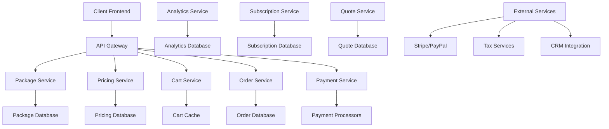

# Design Document

## Overview

The Service Packages API is a comprehensive e-commerce and service management platform built with Node.js/TypeScript that enables package creation, pricing management, shopping cart functionality, and order processing. The design emphasizes flexibility, scalability, and seamless integration with existing portfolio infrastructure.

## Architecture

### High-Level Architecture



### Service Architecture

The system follows a microservices architecture:
1. **Package Service**: Service catalog and package management
2. **Pricing Service**: Dynamic pricing and discount calculations
3. **Cart Service**: Shopping cart and session management
4. **Order Service**: Order processing and fulfillment
5. **Payment Service**: Payment processing and financial operations
6. **Subscription Service**: Recurring billing and subscription management
7. **Quote Service**: Custom quote generation and management
8. **Analytics Service**: Performance tracking and business intelligence

## Components and Interfaces

### Core API Endpoints

#### Package Management API
```typescript
// Package Operations
GET    /api/v1/packages                   // List available packages
GET    /api/v1/packages/:id              // Get package details
POST   /api/v1/packages                  // Create package (admin)
PUT    /api/v1/packages/:id              // Update package (admin)
DELETE /api/v1/packages/:id              // Delete package (admin)

// Package Customization
POST   /api/v1/packages/:id/customize    // Customize package
GET    /api/v1/packages/:id/addons       // Get available add-ons
POST   /api/v1/packages/builder          // Use package builder

// Service Catalog
GET    /api/v1/services                  // List all services
GET    /api/v1/services/categories       // Get service categories
GET    /api/v1/services/:id              // Get service details
GET    /api/v1/services/search           // Search services
```

#### Pricing and Cart API
```typescript
// Pricing Operations
POST   /api/v1/pricing/calculate         // Calculate package price
GET    /api/v1/pricing/discounts         // Get available discounts
POST   /api/v1/pricing/apply-discount    // Apply discount code
GET    /api/v1/pricing/taxes             // Calculate taxes

// Shopping Cart
GET    /api/v1/cart                      // Get cart contents
POST   /api/v1/cart/items                // Add item to cart
PUT    /api/v1/cart/items/:id            // Update cart item
DELETE /api/v1/cart/items/:id            // Remove from cart
POST   /api/v1/cart/clear                // Clear cart
GET    /api/v1/cart/summary              // Get cart summary
```

#### Order and Payment API
```typescript
// Order Management
POST   /api/v1/orders                    // Create order
GET    /api/v1/orders                    // List user orders
GET    /api/v1/orders/:id                // Get order details
PUT    /api/v1/orders/:id                // Update order
POST   /api/v1/orders/:id/cancel         // Cancel order

// Payment Processing
POST   /api/v1/payments/process          // Process payment
GET    /api/v1/payments/methods          // Get payment methods
POST   /api/v1/payments/methods          // Add payment method
GET    /api/v1/payments/history          // Payment history
POST   /api/v1/payments/refund           // Process refund
```

#### Subscription API
```typescript
// Subscription Management
GET    /api/v1/subscriptions             // List subscriptions
POST   /api/v1/subscriptions             // Create subscription
GET    /api/v1/subscriptions/:id         // Get subscription details
PUT    /api/v1/subscriptions/:id         // Update subscription
POST   /api/v1/subscriptions/:id/cancel  // Cancel subscription
POST   /api/v1/subscriptions/:id/pause   // Pause subscription
```

### Data Models

#### Service Package Model
```typescript
interface ServicePackage {
  id: string;
  name: string;
  description: string;
  category: PackageCategory;
  
  // Pricing
  basePrice: number;
  currency: string;
  pricingModel: PricingModel;
  
  // Services Included
  services: PackageService[];
  deliverables: Deliverable[];
  
  // Timeline and Scope
  estimatedDuration: number;
  durationUnit: 'hours' | 'days' | 'weeks' | 'months';
  
  // Customization Options
  isCustomizable: boolean;
  availableAddons: Addon[];
  customizationRules: CustomizationRule[];
  
  // Availability
  isActive: boolean;
  availability: PackageAvailability;
  
  // Marketing
  features: Feature[];
  benefits: string[];
  testimonials: Testimonial[];
  
  // Metadata
  createdAt: Date;
  updatedAt: Date;
  version: number;
  tags: string[];
}

interface PackageService {
  serviceId: string;
  name: string;
  description: string;
  isRequired: boolean;
  isCustomizable: boolean;
  baseHours: number;
  hourlyRate?: number;
  deliverables: string[];
}

interface Addon {
  id: string;
  name: string;
  description: string;
  price: number;
  estimatedHours: number;
  category: string;
  isPopular: boolean;
  dependencies: string[];
  conflicts: string[];
}

type PricingModel = 'fixed' | 'hourly' | 'milestone' | 'subscription' | 'custom';
type PackageCategory = 'web_development' | 'mobile_app' | 'consulting' | 'maintenance' | 'design';
```

#### Shopping Cart Model
```typescript
interface ShoppingCart {
  id: string;
  userId?: string;
  sessionId: string;
  
  // Cart Items
  items: CartItem[];
  
  // Pricing Summary
  subtotal: number;
  discounts: AppliedDiscount[];
  taxes: TaxCalculation[];
  total: number;
  
  // Metadata
  createdAt: Date;
  updatedAt: Date;
  expiresAt: Date;
  
  // Checkout Information
  billingAddress?: Address;
  shippingAddress?: Address;
  paymentMethod?: PaymentMethod;
}

interface CartItem {
  id: string;
  packageId: string;
  packageName: string;
  
  // Customization
  selectedServices: string[];
  addons: SelectedAddon[];
  customizations: Customization[];
  
  // Pricing
  basePrice: number;
  addonPrice: number;
  totalPrice: number;
  
  // Project Information
  projectName?: string;
  projectDescription?: string;
  timeline?: ProjectTimeline;
  
  // Metadata
  addedAt: Date;
}

interface SelectedAddon {
  addonId: string;
  name: string;
  price: number;
  quantity: number;
}
```

#### Order Model
```typescript
interface Order {
  id: string;
  orderNumber: string;
  userId: string;
  
  // Order Items
  items: OrderItem[];
  
  // Pricing
  subtotal: number;
  discounts: AppliedDiscount[];
  taxes: TaxCalculation[];
  total: number;
  
  // Status and Timeline
  status: OrderStatus;
  orderDate: Date;
  expectedDelivery?: Date;
  completedDate?: Date;
  
  // Payment Information
  paymentStatus: PaymentStatus;
  paymentMethod: PaymentMethod;
  paymentTransactions: PaymentTransaction[];
  
  // Billing and Shipping
  billingAddress: Address;
  shippingAddress?: Address;
  
  // Project Information
  projects: ProjectReference[];
  
  // Communication
  notes: OrderNote[];
  
  // Metadata
  createdAt: Date;
  updatedAt: Date;
  createdBy: string;
}

interface OrderItem {
  id: string;
  packageId: string;
  packageName: string;
  packageVersion: string;
  
  // Services and Customizations
  services: OrderService[];
  addons: OrderAddon[];
  customizations: OrderCustomization[];
  
  // Pricing
  basePrice: number;
  addonPrice: number;
  discountAmount: number;
  totalPrice: number;
  
  // Fulfillment
  status: OrderItemStatus;
  assignedTeam?: string[];
  projectId?: string;
  
  // Timeline
  startDate?: Date;
  dueDate?: Date;
  completedDate?: Date;
}

type OrderStatus = 'pending' | 'confirmed' | 'in_progress' | 'completed' | 'cancelled' | 'refunded';
type PaymentStatus = 'pending' | 'processing' | 'paid' | 'failed' | 'refunded' | 'partially_refunded';
type OrderItemStatus = 'pending' | 'assigned' | 'in_progress' | 'delivered' | 'approved' | 'completed';
```

#### Subscription Model
```typescript
interface Subscription {
  id: string;
  userId: string;
  packageId: string;
  
  // Subscription Details
  name: string;
  description: string;
  
  // Billing
  billingCycle: BillingCycle;
  price: number;
  currency: string;
  
  // Status and Timeline
  status: SubscriptionStatus;
  startDate: Date;
  endDate?: Date;
  nextBillingDate: Date;
  
  // Payment
  paymentMethod: PaymentMethod;
  billingHistory: BillingRecord[];
  
  // Usage and Limits
  usageLimits: UsageLimit[];
  currentUsage: UsageRecord[];
  
  // Modifications
  pendingChanges: SubscriptionChange[];
  
  // Metadata
  createdAt: Date;
  updatedAt: Date;
  cancelledAt?: Date;
  cancellationReason?: string;
}

interface BillingRecord {
  id: string;
  billingDate: Date;
  amount: number;
  status: 'pending' | 'paid' | 'failed' | 'refunded';
  invoiceId?: string;
  paymentTransactionId?: string;
  
  // Usage Details
  usagePeriod: DateRange;
  usageDetails: UsageDetail[];
}

type BillingCycle = 'monthly' | 'quarterly' | 'annually' | 'custom';
type SubscriptionStatus = 'active' | 'paused' | 'cancelled' | 'expired' | 'trial';
```

### Service Layer Architecture

#### Package Service
```typescript
class PackageService {
  // Package Management
  async createPackage(packageData: CreatePackageDto): Promise<ServicePackage>;
  async updatePackage(id: string, updates: UpdatePackageDto): Promise<ServicePackage>;
  async deletePackage(id: string): Promise<void>;
  async getPackage(id: string): Promise<ServicePackage>;
  async listPackages(filters: PackageFilters): Promise<PaginatedResult<ServicePackage>>;
  
  // Package Customization
  async customizePackage(packageId: string, customizations: PackageCustomization): Promise<CustomizedPackage>;
  async validateCustomization(packageId: string, customizations: PackageCustomization): Promise<ValidationResult>;
  async getAvailableAddons(packageId: string): Promise<Addon[]>;
  
  // Service Catalog
  async searchServices(query: SearchQuery): Promise<SearchResult<ServicePackage>>;
  async getServiceCategories(): Promise<PackageCategory[]>;
  async getPopularPackages(limit: number): Promise<ServicePackage[]>;
}
```

#### Pricing Service
```typescript
class PricingService {
  // Price Calculation
  async calculatePackagePrice(packageId: string, customizations: PackageCustomization): Promise<PriceCalculation>;
  async calculateCartTotal(cartItems: CartItem[]): Promise<CartTotal>;
  async applyDiscount(cartId: string, discountCode: string): Promise<DiscountResult>;
  
  // Tax Calculation
  async calculateTaxes(amount: number, location: Address): Promise<TaxCalculation>;
  async getTaxRates(location: Address): Promise<TaxRate[]>;
  
  // Dynamic Pricing
  async updatePricing(packageId: string, pricingRules: PricingRule[]): Promise<void>;
  async getPricingHistory(packageId: string): Promise<PriceHistory[]>;
  
  // Discount Management
  async createDiscount(discount: CreateDiscountDto): Promise<Discount>;
  async validateDiscountCode(code: string): Promise<DiscountValidation>;
  async getActiveDiscounts(): Promise<Discount[]>;
}
```

#### Cart Service
```typescript
class CartService {
  // Cart Management
  async getCart(userId: string): Promise<ShoppingCart>;
  async addToCart(userId: string, item: AddToCartDto): Promise<CartItem>;
  async updateCartItem(cartId: string, itemId: string, updates: UpdateCartItemDto): Promise<CartItem>;
  async removeFromCart(cartId: string, itemId: string): Promise<void>;
  async clearCart(cartId: string): Promise<void>;
  
  // Cart Operations
  async getCartSummary(cartId: string): Promise<CartSummary>;
  async validateCart(cartId: string): Promise<CartValidation>;
  async mergeGuestCart(guestCartId: string, userId: string): Promise<ShoppingCart>;
  
  // Checkout Preparation
  async prepareCheckout(cartId: string): Promise<CheckoutSession>;
  async saveCheckoutInfo(cartId: string, info: CheckoutInfo): Promise<void>;
}
```

#### Order Service
```typescript
class OrderService {
  // Order Management
  async createOrder(cartId: string, orderInfo: CreateOrderDto): Promise<Order>;
  async getOrder(orderId: string): Promise<Order>;
  async listOrders(userId: string, filters: OrderFilters): Promise<PaginatedResult<Order>>;
  async updateOrderStatus(orderId: string, status: OrderStatus): Promise<Order>;
  async cancelOrder(orderId: string, reason: string): Promise<Order>;
  
  // Order Processing
  async processOrder(orderId: string): Promise<ProcessingResult>;
  async assignOrderToTeam(orderId: string, teamMembers: string[]): Promise<void>;
  async createProjectFromOrder(orderId: string): Promise<Project>;
  
  // Order Analytics
  async getOrderMetrics(timeRange: TimeRange): Promise<OrderMetrics>;
  async getOrderAnalytics(filters: AnalyticsFilters): Promise<OrderAnalytics>;
}
```

## Integration Architecture

### Payment Gateway Integration
```typescript
interface PaymentGateway {
  name: string;
  type: 'stripe' | 'paypal' | 'square' | 'bank_transfer';
  isActive: boolean;
  
  // Configuration
  config: PaymentGatewayConfig;
  supportedMethods: PaymentMethod[];
  supportedCurrencies: string[];
  
  // Capabilities
  supportsSubscriptions: boolean;
  supportsRefunds: boolean;
  supportsPartialRefunds: boolean;
  
  // Processing
  processPayment(payment: PaymentRequest): Promise<PaymentResult>;
  processRefund(refund: RefundRequest): Promise<RefundResult>;
  
  // Webhooks
  handleWebhook(webhook: WebhookPayload): Promise<void>;
}

class PaymentProcessor {
  async processPayment(orderId: string, paymentInfo: PaymentInfo): Promise<PaymentResult>;
  async processRefund(paymentId: string, amount: number, reason: string): Promise<RefundResult>;
  async setupSubscriptionPayment(subscriptionId: string): Promise<SubscriptionPaymentSetup>;
  async handlePaymentWebhook(gateway: string, payload: WebhookPayload): Promise<void>;
}
```

### CRM Integration
```typescript
interface CRMIntegration {
  // Lead Management
  createLead(orderInfo: OrderInfo): Promise<CRMLead>;
  updateLeadStatus(leadId: string, status: LeadStatus): Promise<void>;
  
  // Customer Management
  createCustomer(userInfo: UserInfo): Promise<CRMCustomer>;
  updateCustomer(customerId: string, updates: CustomerUpdates): Promise<CRMCustomer>;
  
  // Opportunity Tracking
  createOpportunity(quoteInfo: QuoteInfo): Promise<CRMOpportunity>;
  updateOpportunityStage(opportunityId: string, stage: OpportunityStage): Promise<void>;
  
  // Analytics and Reporting
  syncSalesData(timeRange: TimeRange): Promise<SalesData>;
  generateSalesReport(filters: ReportFilters): Promise<SalesReport>;
}
```

## Performance and Optimization

### Caching Strategy
- **Redis Cache**: Cart data, pricing calculations, and session information
- **CDN Caching**: Package images, service descriptions, and static content
- **Application Cache**: Service catalog, pricing rules, and discount codes
- **Database Query Cache**: Frequently accessed package and order data

### Search and Discovery
```typescript
interface SearchEngine {
  // Package Search
  searchPackages(query: SearchQuery): Promise<SearchResult<ServicePackage>>;
  suggestPackages(userId: string, context: SearchContext): Promise<ServicePackage[]>;
  
  // Indexing
  indexPackage(package: ServicePackage): Promise<void>;
  reindexAllPackages(): Promise<void>;
  
  // Analytics
  trackSearch(query: string, results: SearchResult<ServicePackage>): Promise<void>;
  getPopularSearches(): Promise<SearchAnalytics>;
}
```

### Analytics and Reporting
```typescript
interface PackageAnalytics {
  // Sales Metrics
  getSalesMetrics(timeRange: TimeRange): Promise<SalesMetrics>;
  getPackagePerformance(packageId: string): Promise<PackagePerformance>;
  getConversionRates(filters: ConversionFilters): Promise<ConversionMetrics>;
  
  // Customer Behavior
  getCustomerJourney(userId: string): Promise<CustomerJourney>;
  getAbandonedCarts(timeRange: TimeRange): Promise<AbandonedCart[]>;
  
  // Revenue Analytics
  getRevenueAnalytics(timeRange: TimeRange): Promise<RevenueAnalytics>;
  getProfitabilityAnalysis(packageId: string): Promise<ProfitabilityAnalysis>;
  
  // Reporting
  generateSalesReport(filters: ReportFilters): Promise<SalesReport>;
  generatePackageReport(packageId: string): Promise<PackageReport>;
}